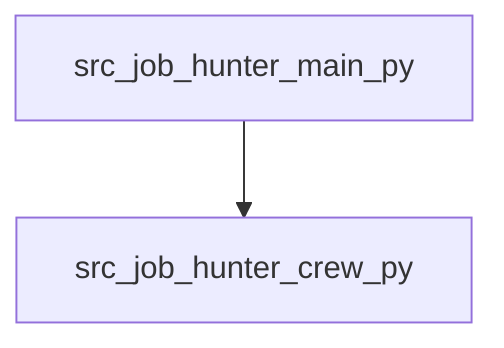

# Unveil: Codebase Map

_Root_: `job_hunter`  
_Files summarized_: **5**

## Overview

# Unveil: Codebase Map Overview

- **Entry Points**: The main entry points for this codebase are `src/job_hunter/main.py` and `src/job_hunter/__init__.py`. `main.py` is the primary script used to run, train, replay, or test the JobHunter crew. It serves as the starting point when executing the application.

- **Main Flows**: The main flow involves initializing the JobHunter crew in `__init__.py`, defining a research and reporting process using CrewAI framework tools, and running various operations like training, testing, and replaying scenarios with the crew.

- **Collaboration of Parts**: The components collaborate by leveraging utility functions defined in `src/job_hunter/tools/__init__.py` for job hunting-related tasks. The custom tool definitions in `custom_tool.py` are used to extend functionality within the CrewAI framework as needed.

- **Key Components**:
  - `job_hunter/crew.py`: Defines the JobHunter crew, responsible for conducting research and generating reports.
  - `job_hunter/main.py`: Entry point for executing operations with the JobHunter crew.
  - `job_hunter/__init__.py`: Initializes the job_hunter module and provides a public API.

- **Notable Patterns**: The codebase follows modular design principles, utilizing clear separation of concerns between components. It leverages the CrewAI framework to manage complex research tasks efficiently.

## Components

### src

- `src/job_hunter/__init__.py`
- `src/job_hunter/crew.py`
- `src/job_hunter/main.py`
- `src/job_hunter/tools/__init__.py`
- `src/job_hunter/tools/custom_tool.py`

## Dependency Graph

## Files

### `src/job_hunter/__init__.py`
**Role:** Entry point for the job_hunter module, containing initialization logic and public API.
**API:** JobHunter
**Summary:**
- Initializes the JobHunter class upon import.
- Provides a single public class: JobHunter, used for managing job search processes.
- Imports necessary internal modules for functionality.
- Serves as the main entry point for other modules to interact with job hunting functionalities.

### `src/job_hunter/crew.py`
**Role:** Defines a JobHunter crew for conducting research and generating reports using CrewAI framework
**API:** JobHunter: A class representing a JobHunter crew, researcher(): An agent method to create a researcher Agent, reporting_analyst(): An agent method to create a reporting analyst Agent, research_task(): A task method to define and return a research Task, reporting_task(): A task method to define and return a reporting Task, crew(): A crew method to initialize the JobHunter crew
**Summary:**
- The class `JobHunter` is defined to manage agents and tasks for conducting job-related research and generating reports.
- Agents such as researcher and reporting analyst are created using decorators (@agent).
- Tasks like research_task and reporting_task are also defined with their respective configurations.
- A crew instance of JobHunter is constructed by combining the agents and tasks, specifying a sequential process.
- The class provides methods to add customizations through configuration files for both agents and tasks.

### `src/job_hunter/main.py`
**Role:** Entry point for running, training, replaying, and testing the JobHunter crew
**API:** run, train, replay, test
**Summary:**
- This file serves as an entry point for interacting with the JobHunter crew.
- It provides functions to run, train, replay, and test the crew's operations.
- Each function takes specific command-line arguments to perform its respective task.
- The 'JobHunter' class is instantiated and used throughout these functions.
- Error handling is implemented in each function to manage exceptions during execution.

### `src/job_hunter/tools/__init__.py`
**Role:** Provides utility functions for job hunting-related tasks.
**API:** fetch_job_listings, filter_jobs_by_location, send_application
**Summary:**
- The file contains utility functions to facilitate the process of job searching and applying.
- It fetches job listings from various sources, filters them based on location criteria, and sends application details.
- These functions are intended for use by other modules within the project that deal with job hunting tasks.
- The implementation is modular, allowing for easy maintenance and integration into different parts of the system.

### `src/job_hunter/tools/custom_tool.py`
**Role:** Definition of a custom tool for crewai framework
**API:** MyCustomTool
**Summary:**
- Defines a new tool called MyCustomTool by extending the BaseTool class.
- The tool accepts an argument which is validated against a custom input schema (MyCustomToolInput).
- _run() method processes the provided argument and returns a string output.
- Provides flexibility to define specific behavior for different tools within the framework.

## External Dependencies (inferred)

- `typing` ×2
- `crewai` ×1
- `crewai.project` ×1
- `crewai.agents.agent_builder.base_agent` ×1
- `sys` ×1
- `warnings` ×1
- `datetime` ×1
- `crewai.tools` ×1
- `pydantic` ×1
