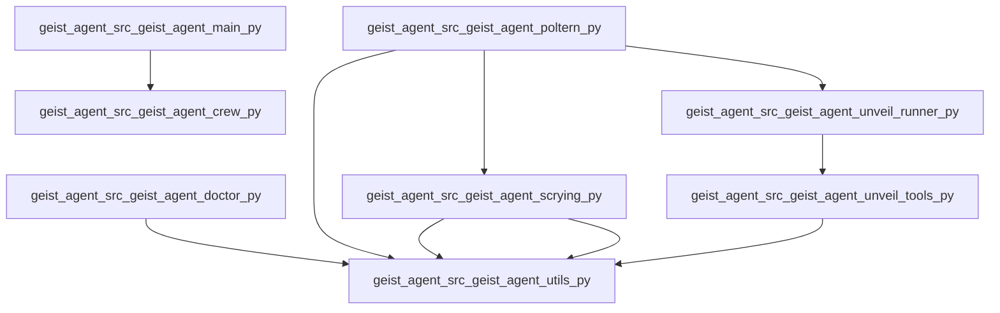

# Unveil: Codebase Map

_Root_: `Geist-Agent`  
_Files summarized_: **12**

## Overview

# Unveil: Codebase Map Overview

## Entry Points & Main Flows

- **`geist_agent/src/geist_agent/__init__.py`**: The entry point for initializing the Geist Agent module.
- **`geist_agent/src/geist_agent/main.py`**: Serves as the primary starting point where the GeistAgent crew runs, trains, replays, and tests. 
- **`geist_agent/src/geist_agent/doctor.py`**: Provides health check utilities to ensure the Geist Agent is functioning properly.
- **`geist_agent/src/geist_agent/scrying.py`, `geist_agent/src/geist_agent/unveil_runner.py`, & `geist_agent/src/geist_agent/unveil_tools.py`**: Collaborate in performing scrying and generating detailed codebase reports.

## How Parts Collaborate

The components work together through a clear modular structure:
- **Agents & Tasks** are defined, configured, and executed via `crew.py`.
- **CLI Interface** (`poltern.py`) provides an interface for various functionalities like scrying, diagnosing, and summarizing the codebase.
- **Unveil Crew** (`unveil_agent.py`), responsible for handling specific agent tasks, integrates with the overall workflow.

## Key Components

- **Agents & Tasks**: Configured via `crew.py`, essential for defining roles within the crew.
- **Custom Tools**: Defined in `custom_tool.py`, extending functionality through the BaseTool framework from CrewAI.
- **Utility Functions**: Found in `utils.py` for generating filenames and loading environment variables.

## Notable Patterns

- **Modular Design**: Clear separation of concerns with each file focusing on specific tasks.
- **CLI Interface**: Provides a user-friendly way to interact with Geist Agent functionalities.
- **Health Check Utility**: Ensures the agent is operational before running complex operations.

This structure allows for efficient development, testing, and maintenance, making it easy for new engineers to understand and contribute.

## Components

### geist_agent

- `geist_agent/src/geist_agent/__init__.py`
- `geist_agent/src/geist_agent/crew.py`
- `geist_agent/src/geist_agent/doctor.py`
- `geist_agent/src/geist_agent/main.py`
- `geist_agent/src/geist_agent/poltern.py`
- `geist_agent/src/geist_agent/scrying.py`
- `geist_agent/src/geist_agent/tools/__init__.py`
- `geist_agent/src/geist_agent/tools/custom_tool.py`
- `geist_agent/src/geist_agent/unveil_agent.py`
- `geist_agent/src/geist_agent/unveil_runner.py`
- `geist_agent/src/geist_agent/unveil_tools.py`
- `geist_agent/src/geist_agent/utils.py`

## Dependency Graph

## Files

### `geist_agent/src/geist_agent/__init__.py`
**Role:** Entry point for the Geist Agent module
**API:** geist_agent
**Summary:**
- Serves as the main interface for initializing and managing the Geist Agent functionality.
- Provides the `geist_agent` class or function to be imported and used elsewhere in the application.
- Likely contains setup and initialization logic specific to the agent.
- Acts as a central point of interaction with other internal modules of the Geist system.

### `geist_agent/src/geist_agent/crew.py`
**Role:** Define and configure agents and tasks for a crew in CrewAI framework
**API:** GeistAgent, researcher, reporting_analyst, research_task, reporting_task, crew
**Summary:**
- This class defines the GeistAgent, which configures and manages agents and tasks within the CrewAI framework.
- It includes methods to create specific agent roles (researcher and reporting analyst) and task configurations (research and reporting tasks).
- The `crew` method constructs a crew with specified agents and tasks, operating in a sequential process.
- Decorators (`@agent`, `@task`, `@crew`) are used to define the behavior of these entities within the framework.
- Configuration details for agents and tasks are referenced from predefined YAML files.

### `geist_agent/src/geist_agent/doctor.py`
**Role:** Health check utility for the Geist Agent
**API:** run
**Summary:**
- Defines a set of checks to verify the health and configuration of the Geist Agent environment.
- Checks include verifying installed package versions, environment variables, Ollama API connectivity, and local file write permissions.
- Provides summary and detailed check results via console output or JSON if requested.
- Can be run as a standalone command with options for JSON output.
- Utilizes utility functions from `geist_agent.utils` for path handling and environment loading.

### `geist_agent/src/geist_agent/main.py`
**Role:** Entry point for running, training, replaying, and testing the GeistAgent crew
**API:** run, train, replay, test
**Summary:**
- This file serves as the main entry point for executing various operations on the GeistAgent crew, such as running, training, replaying, and testing.
- It provides functions to handle different types of operations with predefined inputs related to the topic and current year.
- Each function includes error handling to manage exceptions that may arise during execution.
- The file imports classes from other modules within the Geist_agent package for executing these operations.
- External command-line arguments are used as input parameters for certain functions, allowing for flexible operation setup.

### `geist_agent/src/geist_agent/poltern.py`
**Role:** CLI interface for various geist_agent functionalities including scrying, diagnosing, and unveiling codebase summaries.
**API:** scry(topic), doctor(as_json), unveil_cmd(path, include, exclude, ext, max_files)
**Summary:**
- The file provides a command-line interface for interacting with the geist_agent functionalities including scrying topics, diagnosing system status, and generating codebase summaries.
- It exposes three main commands: `scry`, `doctor`, and `unveil` through Typer CLI framework.
- Each command has its own set of parameters to customize behavior such as specifying a topic for scrying, enabling JSON output for diagnostics, or defining paths and file types for codebase scanning.
- The file also includes an entry point that initializes the Typer application.

### `geist_agent/src/geist_agent/scrying.py`
**Role:** Scrying crew for divination and research operations
**API:** ScryingAgent: Main class for scrying agent, researcher(): Returns a researcher Agent, reporting_analyst(): Returns a reporting analyst Agent, research_task(): Returns a research Task, reporting_task(): Returns a reporting Task with a generated filename, scrying(): Creates the ScryingAgent crew
**Summary:**
- The file defines a scrying agent for divination and research operations, providing methods to generate researcher and reporting analyst agents.
- It includes tasks for conducting research and generating reports, utilizing path utilities for file handling.
- The class uses configuration from `agents_config` and `tasks_config` dictionaries.
- Public functions include creating specific roles and tasks within the scrying crew context.
- The generated report filename is based on a provided topic.

### `geist_agent/src/geist_agent/tools/__init__.py`
**Role:** Tool initialization and utility functions for Geist Agent
**API:** initialize_toolkit, register_tool, get_registered_tools
**Summary:**
- This file initializes the toolkit for various tools used by Geist Agent.
- It provides utilities to register and manage different tools within the agent.
- The functions enable dynamic loading and configuration of tools at runtime.
- Public APIs allow external modules to interact with the tool management system.
- Internal dependencies are likely related to core agent functionalities and logging.
- Called by main agent scripts for setting up initial tool configurations.

### `geist_agent/src/geist_agent/tools/custom_tool.py`
**Role:** Defines a custom tool for an agent using the BaseTool framework from crewai
**API:** MyCustomToolInput, MyCustomTool
**Summary:**
- The file defines an input model `MyCustomToolInput` and a tool class `MyCustomTool` that extends the functionality provided by `BaseTool`.
- It specifies how to structure the input arguments for this custom tool using Pydantic's BaseModel.
- The `_run` method is intended to contain the logic for processing inputs, though it currently just returns an example output.
- This file serves as a blueprint for creating more specialized tools that can be used within the agent framework.
- The class and methods are designed to be easily extendable or customizable.

### `geist_agent/src/geist_agent/unveil_agent.py`
**Role:** Unveil crew configuration and task handling for specific agents
**API:** file_analyst, linker, architect, scan_and_summarize, cross_link, repo_narrative_and_render, unveil
**Summary:**
- This file configures an Unveil crew to handle specific agents and tasks.
- It loads configurations from YAML files, isolating unveil-related settings.
- Agents like file_analyst, linker, and architect are defined and returned.
- Optional tasks for scanning, cross-linking, and rendering are also available.
- A Crew method is provided to instantiate a sequential process with these agents and tasks.

### `geist_agent/src/geist_agent/unveil_runner.py`
**Role:** Runs unveil analysis on codebase files and generates a detailed report.
**API:** run_unveil
**Summary:**
- The function `run_unveil` processes a directory of code files, analyzing each file to generate summaries and dependencies.
- It uses LLM agents for summarizing individual files and writing a repository overview.
- The function supports optional inclusion/exclusion filters and file extensions for targeted analysis.
- Summary outputs are structured in JSON format with specific keys: role, api[], summary[], suspects_deps[], callers_guess[].
- Generated reports include summaries of each file, inferred dependencies, and an overall repository narrative.

### `geist_agent/src/geist_agent/unveil_tools.py`
**Role:** Generate and render reports of file summaries including API, role, and dependencies.
**API:** _format_api_list, _format_summary_list, walk_files, chunk_file, static_imports, _resolve_token_to_file, infer_edges_and_externals, components_from_paths, _mermaid, render_report
**Summary:**
- The file contains functions to generate and render reports of file summaries, including their API, role, and inferred dependencies.
- It includes functions for formatting API documentation, walking directories to find files, chunking large files into manageable parts, resolving imports, inferring external dependencies, grouping files by components, rendering dependency graphs in Mermaid syntax, and generating markdown reports.
- The `render_report` function is the main entry point which generates a comprehensive report based on file summaries, inferred edges, and external dependencies.
- It ensures that the generated report includes an overview of the repository, detailed summaries for each file, and a dependency graph to visualize internal and external dependencies.

### `geist_agent/src/geist_agent/utils.py`
**Role:** Utility functions for generating filenames and loading environment variables for Geist tools.
**API:** ReportUtils.generate_filename, EnvUtils.load_env_for_tool, PathUtils.geist_app_root, PathUtils.ensure_reports_dir
**Summary:**
- The file contains utility functions primarily used by the Geist agent.
- It includes functionality to generate filenames based on provided topics and timestamps.
- It provides methods to load environment variables with specific precedence, ensuring that overrides are handled correctly.
- PathUtils class offers helper methods for resolving app roots and ensuring report directories exist.
- The generated filenames and loaded environment variables play crucial roles in the reporting and configuration management of Geist tools.

## External Dependencies (inferred)

- `typing` ×10
- `pathlib` ×7
- `crewai` ×5
- `os` ×5
- `__future__` ×4
- `crewai.project` ×3
- `crewai.agents.agent_builder.base_agent` ×3
- `datetime` ×3
- `typer` ×2
- `sys` ×2
- `yaml` ×2
- `dataclasses` ×1
- `importlib.metadata` ×1
- `rich.console` ×1
- `rich.table` ×1
- `rich.panel` ×1
- `rich.text` ×1
- `rich.markdown` ×1
- `warnings` ×1
- `geist_agent.customCrew` ×1
- `geist_agent` ×1
- `json` ×1
- `time` ×1
- `collections` ×1
- `re` ×1
- `dotenv` ×1
- `crewai.tools` ×1
- `pydantic` ×1
