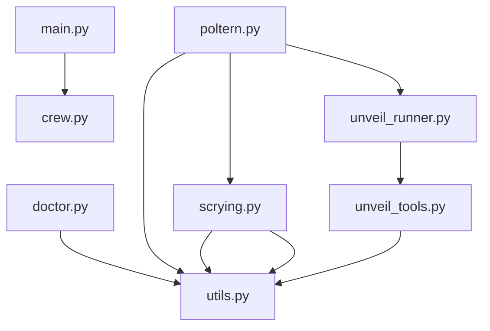

# Unveil: Codebase Map

_Root_: `Geist-Agent`  
_Files summarized_: **12**

## Overview

# Unveil: Codebase Map Overview

## Entry Points & Main Flows
- **`geist_agent/src/geist_agent/__init__.py`**: The main entry point for initializing and configuring the Geist Agent.
- **`geist_agent/src/geist_agent/main.py`**: Primary execution point for running, training, replaying, and testing the GeistAgent crew.

## Collaborations & Key Components
- **Crew Configuration (`crew.py`)**: Uses CrewAI framework to define and configure the GeistAgent crew.
- **Health Check (`doctor.py`)**: Ensures that the geist_agent tool is operational.
- **CLI Interface (`poltern.py`)**: Command-line interface for interacting with Poltergeist Agent functionalities.
- **Unveil Components**:
  - **`unveil_runner.py`**: Runs code analysis tasks and generates reports/summaries.
  - **`unveil_tools.py`**: Analyzes and visualizes dependencies/components within source files.

## Notable Patterns
- Utilizes utility functions for generating filenames (`utils.py`) and loading environment variables, ensuring flexibility and ease of use across Geist tools.
- The `tools` directory houses custom tools designed to enhance workflow systems through specific agent functionalities.

## Components

### geist_agent

- `geist_agent/src/geist_agent/__init__.py`
- `geist_agent/src/geist_agent/crew.py`
- `geist_agent/src/geist_agent/doctor.py`
- `geist_agent/src/geist_agent/main.py`
- `geist_agent/src/geist_agent/poltern.py`
- `geist_agent/src/geist_agent/scrying.py`
- `geist_agent/src/geist_agent/tools/__init__.py`
- `geist_agent/src/geist_agent/tools/custom_tool.py`
- `geist_agent/src/geist_agent/unveil_agent.py`
- `geist_agent/src/geist_agent/unveil_runner.py`
- `geist_agent/src/geist_agent/unveil_tools.py`
- `geist_agent/src/geist_agent/utils.py`

## Dependency Graph

## Files

### `geist_agent/src/geist_agent/__init__.py`
**Role:** Entry point for the Geist Agent module, providing initialization and configuration
**API:** initialize_agent
**Summary:**
- Serves as the main entry point for initializing the Geist Agent with necessary configurations.
- Exposes a single public function `initialize_agent` which sets up the agent environment.
- Facilitates the loading of internal modules and dependencies required by the agent during initialization.

### `geist_agent/src/geist_agent/crew.py`
**Role:** Defines and configures the GeistAgent crew using CrewAI framework.
**API:** GeistAgent, researcher, reporting_analyst, research_task, reporting_task, crew
**Summary:**
- This file defines the GeistAgent class which configures and creates an agent crew using CrewAI.
- It includes methods to create specific agents (researcher, reporting_analyst) and tasks (research_task, reporting_task).
- The crew method assembles these components into a sequential process crew.
- Decorators (@agent, @task, @crew) are used to define the roles within the crew.
- Configuration details for agents and tasks are expected in self.agents_config and self.tasks_config respectively.

### `geist_agent/src/geist_agent/doctor.py`
**Role:** Health-checking utility for the geist_agent tool
**API:** run
**Summary:**
- The file defines a set of health checks for various aspects of the geist_agent environment and dependencies.
- It includes functions to check package versions, environment variables, Ollama model availability, and local storage write permissions.
- These checks are rendered into a console-friendly format using Rich library components.
- A command-line entry point `run` is provided to execute these checks and display the results.

### `geist_agent/src/geist_agent/main.py`
**Role:** Entry point for running, training, replaying, and testing the GeistAgent crew locally
**API:** run, train, replay, test
**Summary:**
- This file serves as an entry point for local operations of the GeistAgent.
- It provides functions to run, train, replay, and test the crew with specific inputs.
- The `run` function executes the crew using default inputs.
- The `train`, `replay`, and `test` functions allow for more controlled operations like training, replaying tasks, or testing execution.
- It imports classes from `geist_agent.crew` and `geist_agent.customCrew` to perform its operations.

### `geist_agent/src/geist_agent/poltern.py`
**Role:** CLI for Poltergeist Agent
**API:** scry(topic), doctor(as_json), unveil_cmd(path, include, exclude, ext, max_files)
**Summary:**
- This file defines the command-line interface (CLI) for the Poltergeist Agent tool.
- It includes commands for scrying a topic to generate a report, performing diagnostics on the environment, and scanning the codebase.
- Each command is decorated with typer.App commands to facilitate CLI operations.
- The file imports necessary modules from other parts of the geist_agent package for its functionality.
- It leverages custom utilities like EnvUtils and external functions like ScryingAgent and run_unveil for specific tasks.

### `geist_agent/src/geist_agent/scrying.py`
**Role:** Scrying crew agent for divination and research operations
**API:** ScryingAgent, set_topic, researcher, reporting_analyst, research_task, reporting_task, scrying
**Summary:**
- Defines a ScryingAgent class for conducting research and generating reports.
- Exposes methods to configure agents, tasks, and generate crew configurations.
- Uses utility functions for filename generation and directory management.
- Performs sequential processing of research and reporting tasks.
- Deploys Agents and Tasks based on predefined configurations.

### `geist_agent/src/geist_agent/tools/__init__.py`
**Role:** Utility entry point for geist_agent tools
**API:** register_tools
**Summary:**
- Serves as an initialization file for the geist_agent package, defining and registering various tools.
- The `register_tools` function is called to initialize the toolset available within the geist_agent environment.
- It likely imports and registers different utility modules or classes that provide specific functionalities.
- This file acts as a central hub for managing and accessing various tools used by other parts of the geist_agent system.

### `geist_agent/src/geist_agent/tools/custom_tool.py`
**Role:** Defines a custom tool for an agent to use within a workflow system
**API:** MyCustomTool
**Summary:**
- Imports necessary modules and classes for defining a custom tool, including the input schema.
- Extends the `BaseTool` class to create a new tool named 'MyCustomTool' with specified attributes like name, description, and arguments schema.
- Defines an input schema called `MyCustomToolInput` using Pydantic's BaseModel for handling inputs.
- Implements a `_run` method that processes the provided argument and returns a string output.
- Depicts how this tool can be utilized within a system where agents require specific tools to perform tasks.

### `geist_agent/src/geist_agent/unveil_agent.py`
**Role:** Unveil crew for specific configurations
**API:** file_analyst() -> Agent, linker() -> Agent, architect() -> Agent, scan_and_summarize() -> Task, cross_link() -> Task, repo_narrative_and_render() -> Task, unveil() -> Crew
**Summary:**
- Loads and processes unveil_* configurations from YAML files.
- Excludes non-unveil tasks and agents, isolating the relevant configurations.
- Defines multiple agent functions using Agent class to handle specific tasks.
- Includes optional task definitions for scanning, cross-linking, and rendering narratives.
- Provides a crew function that assembles agents and tasks into a sequential process.

### `geist_agent/src/geist_agent/unveil_runner.py`
**Role:** Runs code analysis for unveiling agent tasks, generating reports and summaries.
**API:** run_unveil
**Summary:**
- The `unveil_runner.py` script is responsible for executing a series of steps to analyze a codebase. It processes files, creates summaries using an LLM, and generates a repository overview.
- It uses various helper functions like `_get_unveil_agents`, `_log`, `_parse_json_maybe_fenced`, `walk_files`, `chunk_file`, `static_imports`, `infer_edges_and_externals`, and `components_from_paths` to perform its tasks.
- The script includes detailed logging mechanisms, allowing it to output information and errors during execution.
- It calls the LLM agents (`file_analyst` and `architect`) for generating summaries and an overview of the repository, respectively.
- It outputs a report that includes file summaries, external dependencies, components, and an overall narrative about the repository.

### `geist_agent/src/geist_agent/unveil_tools.py`
**Role:** Analyzes and visualizes dependencies and components within source files
**API:** _format_api_list, _format_summary_list, walk_files, chunk_file, static_imports, _resolve_token_to_file, infer_edges_and_externals, components_from_paths, _friendly_labels, _mermaid, render_report
**Summary:**
- The file contains utility functions for analyzing and visualizing dependencies in source files.
- It includes methods to format API and summary information, walk through directory structures, and chunk large files.
- The `render_report` function generates a detailed report including dependency graphs and component summaries.
- Internal dependencies include other modules like `ReportUtils`, `PathUtils`, and regular expressions for parsing imports.
- This file is likely used by higher-level scripts or tools to analyze codebases.

### `geist_agent/src/geist_agent/utils.py`
**Role:** Utility functions for generating filenames and loading environment variables for Geist tools
**API:** ReportUtils.generate_filename, EnvUtils.load_env_for_tool, PathUtils.geist_app_root, PathUtils.ensure_reports_dir
**Summary:**
- Provides utility functions for generating filenames based on topics and timestamps, which is useful for report generation.
- Loads environment variables in a prioritized manner from various sources such as explicit paths, user-specific directories, packaged defaults, and current working directory.
- Offers methods to resolve the Geist application root path and ensure the existence of reports directories with optional subfolders.
- Designed to be flexible and adaptable for both development and production environments.

## External Dependencies (inferred)

- `typing` ×10
- `pathlib` ×7
- `crewai` ×5
- `os` ×5
- `__future__` ×4
- `crewai.project` ×3
- `crewai.agents.agent_builder.base_agent` ×3
- `datetime` ×3
- `typer` ×2
- `sys` ×2
- `yaml` ×2
- `dataclasses` ×1
- `importlib.metadata` ×1
- `rich.console` ×1
- `rich.table` ×1
- `rich.panel` ×1
- `rich.text` ×1
- `rich.markdown` ×1
- `warnings` ×1
- `geist_agent.customCrew` ×1
- `geist_agent` ×1
- `json` ×1
- `time` ×1
- `collections` ×1
- `re` ×1
- `dotenv` ×1
- `crewai.tools` ×1
- `pydantic` ×1
