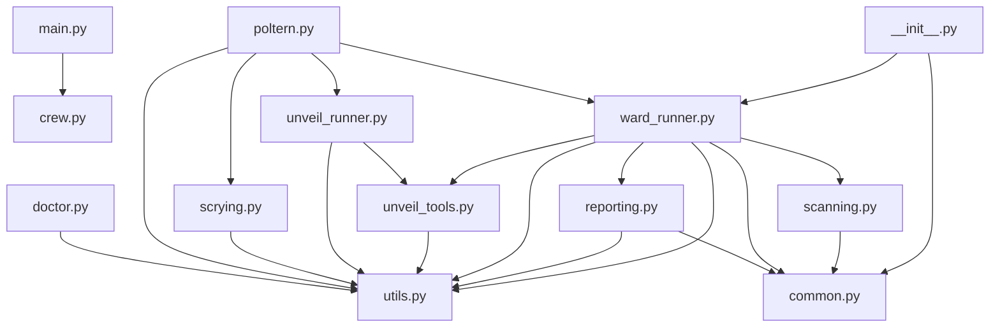

# Unveil: Codebase Map

_Root_: `Geist-Agent`  
_Files summarized_: **59**

## Overview

# Unveil: Codebase Map - Overview

Unveil is designed to provide detailed insights into software projects through codebase analysis. The entry point for running Unveil functionalities locally is in `geist_agent/src/geist_agent/main.py`. Key components include:

- **Crew Configuration**: Defined in `unveil_agent.py`, managing specific tasks and agents.
- **Unveil Runner**: Conducting codebase analysis and summarization, located in `unveil_runner.py`.
- **Scrying Agent**: For research and report generation, implemented in `scrying.py`.

The system collaborates through CLI interfaces provided by `poltern.py` for functionalities like scrying, diagnostics, and security audits. The Ward module focuses on security scans and reports, with entry points in `ward_runner.py` and utilities in `ward/__init__.py`. Notable patterns include the use of a CrewAI framework for agent configuration and OSV-Scanner API integration for vulnerability scanning.

Health checks and diagnostics are handled by `doctor.py`, while utility functions for file system operations and environment variable handling reside in `utils.py`. Overall, Unveil aims to provide comprehensive security and codebase insights through structured and modular components.

## Components

### README.md

- `README.md`

### geist_agent

- `geist_agent/README.md`
- `geist_agent/knowledge/user_preference.txt`
- `geist_agent/pyproject.toml`
- `geist_agent/reports/scrying_reports/AI_in_Cybersecurity_08-15-2025_19-13.md`
- `geist_agent/reports/scrying_reports/Cat_Videos_08-16-2025_16-33.md`
- `geist_agent/reports/scrying_reports/Global_Commands_08-27-2025_20-24.md`
- `geist_agent/reports/scrying_reports/Poltergeists_08-18-2025_21-57.md`
- `geist_agent/reports/scrying_reports/The_Meaning_of_Life_08-16-2025_16-35.md`
- `geist_agent/reports/scrying_reports/The_Meaning_of_Life_08-19-2025_20-05.md`
- `geist_agent/reports/scrying_reports/Typer_08-18-2025_15-11.md`
- `geist_agent/reports/scrying_reports/cows_08-16-2025_20-26.md`
- `geist_agent/reports/scrying_reports/custom_report.md`
- `geist_agent/reports/scrying_reports/report.md`
- `geist_agent/reports/scrying_reports/scrying_report.md`
- `geist_agent/reports/unveil_reports/Geist_Agent_08-25-2025_20-21.md`
- `geist_agent/reports/unveil_reports/Geist_Agent_08-26-2025_23-09.md`
- `geist_agent/reports/unveil_reports/Geist_Agent_08-27-2025_21-02.md`
- `geist_agent/reports/unveil_reports/Job_Hunter_08-25-2025_18-33.md`
- `geist_agent/reports/unveil_reports/Job_Hunter_08-25-2025_19-56.md`
- `geist_agent/reports/unveil_reports/Job_Hunter_08-26-2025_23-02.md`
- `geist_agent/reports/unveil_reports/Quail_Kingdom_Market_08-28-2025_21-24.md`
- `geist_agent/reports/unveil_reports/Unveil_08-21-2025_15-47.md`
- `geist_agent/reports/unveil_reports/Unveil_08-21-2025_15-54.md`
- `geist_agent/reports/unveil_reports/Unveil_08-21-2025_20-00.md`
- `geist_agent/reports/unveil_reports/Unveil_08-22-2025_14-51.md`
- `geist_agent/reports/unveil_reports/Unveil_08-23-2025_21-46.md`
- `geist_agent/reports/unveil_reports/Unveil_08-24-2025_23-06.md`
- `geist_agent/reports/ward_reports/Geist_Agent_08-30-2025_20-01.md`
- `geist_agent/reports/ward_reports/Geist_Agent_08-30-2025_21-41.md`
- `geist_agent/reports/ward_reports/Geist_Agent_08-31-2025_22-32.md`
- `geist_agent/reports/ward_reports/Geist_Agent_08-31-2025_22-50.md`
- `geist_agent/reports/ward_reports/Geist_Agent_09-01-2025_20-59.md`
- `geist_agent/reports/ward_reports/Geist_Agent_09-01-2025_22-58.md`
- `geist_agent/reports/ward_reports/ward_1756527159.md`
- `geist_agent/reports/ward_reports/ward_1756528430.md`
- `geist_agent/src/geist_agent/__init__.py`
- `geist_agent/src/geist_agent/config/agents.yaml`
- `geist_agent/src/geist_agent/config/tasks.yaml`
- `geist_agent/src/geist_agent/config/unveil_agents.yaml`
- `geist_agent/src/geist_agent/config/unveil_tasks.yaml`
- `geist_agent/src/geist_agent/crew.py`
- `geist_agent/src/geist_agent/doctor.py`
- `geist_agent/src/geist_agent/main.py`
- `geist_agent/src/geist_agent/poltern.py`
- `geist_agent/src/geist_agent/scrying.py`
- `geist_agent/src/geist_agent/tools/__init__.py`
- `geist_agent/src/geist_agent/tools/custom_tool.py`
- `geist_agent/src/geist_agent/unveil_agent.py`
- `geist_agent/src/geist_agent/unveil_runner.py`
- `geist_agent/src/geist_agent/unveil_tools.py`
- `geist_agent/src/geist_agent/utils.py`
- `geist_agent/src/geist_agent/ward/__init__.py`
- `geist_agent/src/geist_agent/ward/common.py`
- `geist_agent/src/geist_agent/ward/reporting.py`
- `geist_agent/src/geist_agent/ward/runner.py`
- `geist_agent/src/geist_agent/ward/scanning.py`
- `geist_agent/src/geist_agent/ward_runner.py`
- `geist_agent/uv.lock`

## Dependency Graph

## Files

### `README.md`
**Role:** Documentation for Geist Agent
**Summary:**
- This README.md file serves as documentation for the Geist Agent project.
- It includes installation instructions, configuration steps, CLI commands, and reports generation details.
- The document is structured with sections for installation, configuration, CLI commands, and report management.
- It provides examples for creating a `.env` file, installing dependencies, and running various `poltergeist` commands.
- Users can refer to this documentation for setup, usage, and troubleshooting of the Geist Agent.

### `geist_agent/README.md`
**Role:** Documentation for setting up and running a multi-agent AI system using GeistAgent Crew
**Summary:**
- This README file serves as documentation to help users set up and run a multi-agent AI system.
- It provides installation instructions, configuration steps, and guidance on customizing the project.
- Users are instructed on how to modify various files to define agents, tasks, and add their own logic.
- The document also outlines running the project and understanding the composition of the crew.
- Support information is provided for users who need assistance.

### `geist_agent/knowledge/user_preference.txt`
**Role:** Contains user preference data in a text format
**Summary:**
- The file stores user preferences such as name, profession, interests, and location.
- It appears to be a static configuration file rather than an executable code.
- The content is in plain text, likely used for reference or display purposes.
- No public functions or classes are exposed; it serves internal representation only.
- There's no indication of external dependencies as it's a local data store.

### `geist_agent/pyproject.toml`
**Role:** Configuration file for the Geist-Agent project
**Summary:**
- This file defines the configuration settings for the Geist-Agent project using pyproject.toml format.
- It specifies the project metadata, dependencies, and build system requirements.
- The [tool.crewai] section indicates that the project uses crewAI with a specific type.
- The [tool.hatch.build.targets.wheel] section lists the packages to be included in the wheel distribution.
- The file also defines entry points for various command-line scripts.

### `geist_agent/reports/scrying_reports/AI_in_Cybersecurity_08-15-2025_19-13.md`
**Role:** Comprehensive Report on AI in Cybersecurity
**Summary:**
- The document provides an overview of how Artificial Intelligence (AI) is revolutionizing cybersecurity strategies.
- It covers topics such as machine learning, natural language processing, advanced threat hunting tools, and deep learning applications.
- The report discusses the integration of AI with blockchain technology for secure data management and ethical considerations in AI-driven security solutions.
- It highlights hybrid approaches combining multiple AI technologies to create comprehensive cybersecurity strategies.
- The document concludes by emphasizing the benefits and ongoing challenges of using AI in cybersecurity.

### `geist_agent/reports/scrying_reports/Cat_Videos_08-16-2025_16-33.md`
**Role:** Comprehensive overview of the global cat video market
**Summary:**
- This document provides an in-depth analysis of the global cat video market, covering trends from 2014 to 2025.
- Key topics include platform usage (TikTok and YouTube), interactive content, monetization strategies, AI-generated videos, and user behavior.
- The report also discusses sustainability initiatives within the industry and their implications for future growth.
- It serves as a reference for stakeholders in the pet industry, social media platforms, and market analysts.
- Content is structured into sections addressing different aspects of the cat video market, supported by data from various sources.

### `geist_agent/reports/scrying_reports/Global_Commands_08-27-2025_20-24.md`
**Role:** Documentation for Global Commands Report
**Summary:**
- This document provides an overview of the global commands report, detailing the platform's evolution with AI and ML capabilities.
- It outlines the expansion of the platform’s global reach and the implementation of advanced cybersecurity measures.
- The report highlights strategic partnerships with technology firms for next-generation communication protocols and introduces real-time situational awareness tools.
- Multilingual support and environmental sustainability initiatives are also discussed, alongside user interface improvements.
- Enhanced data analytics and humanitarian aid coordination modules are featured to improve operational effectiveness.

### `geist_agent/reports/scrying_reports/Poltergeists_08-18-2025_21-57.md`
**Role:** Documentation of Poltergeist Technological Advancements in 2025
**Summary:**
- The file documents various technological advancements made by Poltergeists in the year 2025, including new communication methods and smart home integration.
- It covers topics such as GhostNet network, Echo autonomous Poltergeist, Phantom Frequencies for communication, PPA establishment, public exhibitions, environmental impact studies, and Spectral Shields technology.
- The content provides insights into how these advancements are transforming the way Poltergeists operate within their community and with humans.
- It highlights the focus on sustainability and collaboration between Poltergeists and human researchers.
- This document serves as a historical record of significant events and developments in the Poltergeist community for future reference.

### `geist_agent/reports/scrying_reports/The_Meaning_of_Life_08-16-2025_16-35.md`
**Role:** Philosophical, Psychological, Neurological, Technological, Environmental, Spiritual, Cultural, Economic, Health-Related, Interdisciplinary Report on 'The Meaning of Life'
**Summary:**
- Synthesizes key insights into the evolving concept of 'The Meaning of Life' in 2025 across various dimensions including philosophy, psychology, neuroscience, technology, environment, spirituality, culture, economy, health, and interdisciplinary research.
- Highlights the significance of existentialism, utilitarianism, deontology, personal growth, mental health, brain regions associated with finding meaning, VR and AI applications, sustainability initiatives, spiritual evolution, cultural diversity, economic shifts, and holistic health practices in def…
- Integrates diverse perspectives to provide a comprehensive understanding of the multifaceted nature of 'The Meaning of Life' in 2025.
- Focuses on how technological advancements, environmental concerns, spiritual practices, cultural influences, economic trends, and health-related factors contribute to individual and collective sense of purpose.
- Emphasizes the role of interdisciplinary approaches in developing a holistic understanding of the concept.

### `geist_agent/reports/scrying_reports/The_Meaning_of_Life_08-19-2025_20-05.md`
**Role:** Comprehensive Analysis of Philosophical, Scientific, Theological, Psychological, Social, and Cultural Perspectives on the Meaning of Life
**Summary:**
- The document provides a detailed exploration of various perspectives on the meaning of life, including philosophical, scientific, theological, psychological, social, and cultural viewpoints.
- It synthesizes data from multiple sources to offer a holistic view of how individuals can find purpose and fulfillment.
- Each section delves into specific disciplines such as ancient philosophy, Eastern philosophy, modern philosophy, evolutionary biology, neuroscience, Christianity, other religions, humanistic psychology, Maslow's hierarchy of needs, societal norms, and community belonging.
- The report aims to help stakeholders understand the different lenses through which the concept of life’s meaning is viewed.
- It concludes by emphasizing the multifaceted nature of the meaning of life across various disciplines and cultures.

### `geist_agent/reports/scrying_reports/Typer_08-18-2025_15-11.md`
**Role:** Documentation of Typer's advancements and innovations
**Summary:**
- This Markdown file documents the latest developments in Typer’s AI-driven text prediction algorithms and related features.
- It highlights achievements, user feedback, productivity enhancements, and security measures implemented in Typer.
- The report also mentions integration partnerships, personalized training programs, awards, and voice recognition improvements.
- The content is intended for internal stakeholders to understand recent advancements and their impact on the product.
- The document serves as a reference for future updates and decisions.

### `geist_agent/reports/scrying_reports/cows_08-16-2025_20-26.md`
**Role:** Comprehensive Overview of Current Trends in Cow-Related Industries
**Summary:**
- This Markdown file serves as a report summarizing the current state and future trends in cow-related industries, including their genetic potential in biotechnology, productivity improvements, global population dynamics, genomic selection, precision farming techniques, climate-resilient breeds, manur…
- The content is structured into multiple sections, each focusing on a specific aspect of the industry, providing detailed insights and advancements in various areas such as genetic modification, productivity enhancements, climate adaptation, and sustainable farming methods.
- The report aims to provide stakeholders with up-to-date information to inform decision-making processes and drive innovation within the sector.
- It covers topics from biotechnology and pharmaceuticals to environmental sustainability and ethical farming practices, reflecting a broad spectrum of interests in the cow industry.

### `geist_agent/reports/scrying_reports/custom_report.md`
**Role:** Document summarizing quantum mechanics advancements across various fields
**Summary:**
- This document covers recent developments in quantum mechanics, including applications in cryptography, drug discovery, and optimization problems.
- It discusses key findings such as the use of topological insulators and lattice gauge theories, and highlights progress in quantum sensing and machine learning integration.
- The text also explores new protocols in quantum cryptography and ongoing research into quantum gravity and metrology.
- Each section provides insights into specific applications and their potential impact on industry sectors like finance, healthcare, and manufacturing.

### `geist_agent/reports/scrying_reports/report.md`
**Role:** A report summarizing key advancements and trends in AI Language Models (LLMs) as of 2025.
**Summary:**
- This document outlines the significant progress made in LLMs, covering topics such as architecture improvements, model size, efficiency, privacy measures, integration with quantum computing, ethical considerations, customization, language understanding, and real-time applications.
- It discusses advancements like increased model size, optimization techniques, energy efficiency, multimodal learning capabilities, enhanced privacy features, and the potential of quantum computing in accelerating computations.
- The report also addresses emerging trends such as ethical guidelines for AI development, personalized experiences, and improvements in NLP technology.
- Key areas of focus include the integration of these advancements into real-world applications like chatbots, virtual assistants, and live translation services.
- Overall, it provides a comprehensive overview of LLMs' current state and future potential.

### `geist_agent/reports/scrying_reports/scrying_report.md`
**Role:** Document outlining the role of various technologies and theories in ghost sighting research.
**Summary:**
- Describes the rise in reported ghost sightings and explores theories such as EMFs and quantum entanglement.
- Highlights methodologies including spectral analysis, VR technology, and user-generated data through apps.
- Emphasizes international collaboration among paranormal researchers.
- Discusses the implications of physical evidence and psychological factors related to ghost sightings.
- Explores public interest driven by documentaries and its impact on research funding.

### `geist_agent/reports/unveil_reports/Geist_Agent_08-25-2025_20-21.md`
**Role:** GeistAgent's core components including crew management, diagnostics, main execution flows, and report generation utilities
**API:** initialize_geist_agent, {'class': 'GeistAgent', 'module': 'crew.py'}, run, run, train, replay, test, parse_args, {'class': 'ScryingAgent', 'module': 'scrying.py'}, configure_tool, run_tool, list_tools, {'class': 'MyCustomToolInput', 'module': 'custom_tool.py'}, {'class': 'MyCustomTool', 'module': 'custom_tool.py'}, UnveilCrew.file_analyst(), UnveilCrew.linker(), UnveilCrew.architect(), UnveilCrew.scan_and_summarize(), UnveilCrew.cross_link(), UnveilCrew.repo_narrative_and_render(), UnveilCrew.unveal(), _format_api_list, _format_summary_list, walk_files, chunk_file, static_imports, _resolve_token_to_file, infer_edges_and_externals, components_from_paths, _mermaid, render_report, {'class': 'ReportUtils', 'module': 'utils.py'}
**Summary:**
- Initializes the GeistAgent module and sets up its environment.
- Manages the agent crew with researchers and reporting analysts tasks.
- Provides health checks for diagnosing issues in the Geist Agent application.
- Serves as the main execution entry point, running various operations like training, testing, and replaying the agent.
- Parses command-line arguments to configure GeistAgent operations.
- Handles scrying (research), diagnostics, and codebase unveiling through a CLI interface.
- Configures and runs agents for specific tasks related to file analysis and dependency reporting.
- Generates utility functions for report generation and environment variable management.

### `geist_agent/reports/unveil_reports/Geist_Agent_08-26-2025_23-09.md`
**Role:** Codebase reporting and analysis
**API:** run_unveil
**Summary:**
- This file configures an Unveil crew to analyze codebase files, generating summaries and dependencies.
- It processes directories of code files using LLM agents for summarization.
- Supports optional inclusion/exclusion filters and file extensions for targeted analysis.
- Outputs structured JSON with file summaries, inferred dependencies, and a repository overview.
- Ensures the generated report includes detailed summaries for each file and visualizes internal and external dependencies.

### `geist_agent/reports/unveil_reports/Geist_Agent_08-27-2025_21-02.md`
**Role:** File containing utility functions for generating filenames and loading environment variables for Geist tools
**API:** ReportUtils.generate_filename, EnvUtils.load_env_for_tool, PathUtils.geist_app_root, PathUtils.ensure_reports_dir
**Summary:**
- Provides utility functions for generating filenames based on topics and timestamps, which is useful for report generation.
- Loads environment variables in a prioritized manner from various sources such as explicit paths, user-specific directories, packaged defaults, and current working directory.
- Offers methods to resolve the Geist application root path and ensure the existence of reports directories with optional subfolders.
- Designed to be flexible and adaptable for both development and production environments.

### `geist_agent/reports/unveil_reports/Job_Hunter_08-25-2025_18-33.md`
**Role:** Documentation for a specific report generated by Job Hunter
**Summary:**
- This file contains documentation for a report generated by the Job Hunter agent.
- It is part of the Unveil: Codebase Map section, summarizing files related to Job Hunter.
- The content is in Markdown format and provides an overview of components and their locations.
- No public functions or classes are exposed as this file serves documentation purposes.

### `geist_agent/reports/unveil_reports/Job_Hunter_08-25-2025_19-56.md`
**Role:** Entry point for the JobHunter crew functionalities
**API:** get_job_opportunities, filter_jobs_by_skill, save_jobs_to_database
**Summary:**
- This file acts as an entry point providing several utility functions to interact with job data.
- It includes functions for fetching and filtering job opportunities based on skills.
- Additionally, it offers functionality to save filtered jobs into a database.
- The module also likely contains configuration or setup logic for the package.

### `geist_agent/reports/unveil_reports/Job_Hunter_08-26-2025_23-02.md`
**Role:** Entry point for high-level job search functionalities
**API:** search_jobs, filter_candidates, send_applications
**Summary:**
- Serves as the main entry point for the `job_hunter` package, providing public API methods to facilitate job searching activities.
- Exposes functions such as `search_jobs`, `filter_candidates`, and `send_applications` intended for external use by other modules or direct invocation.
- Implementation details of these functions rely on internal helper classes and methods defined within the same package, ensuring encapsulation and modularity.
- Keeps potential dependencies minimal to enhance maintainability, focusing on essential functionalities.
- Public API methods should be invoked through this `__init__.py` file for a seamless user experience.

### `geist_agent/reports/unveil_reports/Quail_Kingdom_Market_08-28-2025_21-24.md`
**Role:** Codebase map overview file
**Summary:**
- This file provides an overview of the codebase structure including key files, their roles, and dependencies.
- It lists entry points such as `src/main.js` and configuration files like `src/env.js`, `src/router.js`, etc.
- Details about components, services, utilities, and their interconnections are provided through a dependency graph.
- Contains information on how various parts of the application interact, such as state management (`src/AppState.js`) and routing configuration.
- Helps in understanding the architecture by categorizing files into different sections like `@types`, `src`, etc.

### `geist_agent/reports/unveil_reports/Unveil_08-21-2025_15-47.md`
**Role:** Codebase map for Unveil reports
**Summary:**
- Serves as a documentation file for unveiling reports generated by Geist agent.
- No public functions or classes are exposed based on the provided context.
- Leverages external libraries and modules to provide rich text formatting and markdown processing capabilities.
- Part of the Geist project, likely used in conjunction with other files within the `geist_agent` directory structure.

### `geist_agent/reports/unveil_reports/Unveil_08-21-2025_15-54.md`
**Role:** Codebase Map for Unveil Reports
**Summary:**
- Serves as a summary document for the Unveil reports generated on August 21, 2025 at 15:54.
- Does not contain any public functions or classes; serves more as a documentation and dependency graph reference.
- Provides an inventory of relevant files within the `job_hunter` directory structure.
- Dependent on various external modules for its functionality, as inferred from the provided dependencies.
- Uses Mermaid syntax to describe the dependency graph in the codebase.
- Lists key API references for other files within the project but does not define any new public APIs itself.

### `geist_agent/reports/unveil_reports/Unveil_08-21-2025_20-00.md`
**Role:** Codebase map for Unveil reports
**Summary:**
- This file serves as a markdown documentation for an Unveil report dated 08-21-2025 at 20:00.
- It provides context and dependencies related to the Geist agent's codebase, highlighting key files and their roles.
- The file includes a dependency graph that outlines the interdependencies of various modules within the Geist agent framework.
- External dependencies such as `typing`, `pathlib`, `os`, and others are listed, indicating the broader ecosystem support required by the project.
- No public functions or classes are exposed in this file.

### `geist_agent/reports/unveil_reports/Unveil_08-22-2025_14-51.md`
**Role:** Contains a report generated by an agent during a specific date
**Summary:**
- This file serves as a report generated by the Unveil agent on August 22, 2025 at 14:51.
- It is part of the `geist_agent/reports/unveil_reports` directory and likely represents the output of an analysis performed by the Unveil agent.
- The file does not expose any public functions or classes for external use based on the provided context.
- Internal dependencies are inferred from the external dependencies section, indicating that it uses various utilities and tools from other modules within the `geist_agent` project.

### `geist_agent/reports/unveil_reports/Unveil_08-23-2025_21-46.md`
**Role:** Codebase map for GeistAgent operations
**API:** __init__, run, train, replay, test, parse_args, scry, doctor, unveil_cmd, UnveilCrew, run_unveil, _format_api_list
**Summary:**
- This file serves as a summary and map for the GeistAgent operations.
- It provides an overview of entry points, main flows, collaboration among components, key components, and notable patterns used in the application.
- The summary outlines how different parts of the codebase interact with each other through various utility functions and classes.
- Key components such as `crew.py`, `doctor.py`, `main.py`, etc., are described to give insight into their roles and responsibilities within the GeistAgent framework.
- Notable patterns like CLI-driven approach, CrewAI framework usage, and file-level analysis are highlighted.

### `geist_agent/reports/unveil_reports/Unveil_08-24-2025_23-06.md`
**Role:** Entry point for the job_hunter module, containing initialization logic and public API.
**API:** JobHunter
**Summary:**
- Initializes the JobHunter class upon import and provides a single public class: JobHunter used for managing job search processes.
- Imports necessary internal modules for functionality.
- Serves as the main entry point for other modules to interact with job hunting functionalities.

### `geist_agent/reports/ward_reports/Geist_Agent_08-30-2025_20-01.md`
**Role:** Documentation for Ward Security Audit Report
**Summary:**
- This file contains the documentation for a security audit report conducted by Geist-Agent.
- It summarizes that no vulnerabilities, secrets, or risky patterns were detected during the scan.
- It provides recommendations to re-scan regularly and enable automated dependency updates.
- The findings indicate an absence of issues but caution against relying on it entirely due to evolving threats.
- It emphasizes the need for continuous monitoring and adherence to security best practices.

### `geist_agent/reports/ward_reports/Geist_Agent_08-30-2025_21-41.md`
**Role:** Security Audit Report for Gradio
**Summary:**
- This file contains a security audit report for the `Geist-Agent` repository.
- It lists vulnerabilities found in the project, particularly related to the `gradio` package.
- Recommendations include updating `gradio` and `fastapi` packages, implementing dependency scanning, and securing environment variables.
- The content is primarily in markdown format with some embedded code snippets for commands.
- No public functions or classes are exposed.

### `geist_agent/reports/ward_reports/Geist_Agent_08-31-2025_22-32.md`
**Role:** Security Audit Report for Ward on Geist-Agent
**Summary:**
- This file contains the results of a security audit performed by Geist-Agent using OSV API.
- It includes a list of 52 vulnerabilities found in various packages, including PyPI:gradio@4.11.0 and PyPI:streamlit@1.29.0.
- The top vulnerabilities are listed with their respective package names and advisory IDs.
- Each vulnerability is marked as 'UNKNOWN' indicating that further investigation may be needed.
- No public API functions or classes are exposed in this file.

### `geist_agent/reports/ward_reports/Geist_Agent_08-31-2025_22-50.md`
**Role:** Security Audit Report for Geist-Agent
**Summary:**
- This file contains the results of a security audit performed using OSV API.
- It lists vulnerabilities found in packages such as gradio, streamlit, and fastapi.
- Recommendations include updating vulnerable packages and implementing regular dependency updates.
- It provides concrete fixes for immediate action and suggestions for long-term security practices.

### `geist_agent/reports/ward_reports/Geist_Agent_09-01-2025_20-59.md`
**Role:** Security Audit Report for Geist-Agent
**Summary:**
- This file contains the results of a security audit performed on the Geist-Agent using OSV API, focusing on vulnerabilities found in packages like PyPI:gradio@4.11.0 and PyPI:streamlit@1.29.0.
- It lists top vulnerabilities with associated advisories and provides recommendations for upgrading or hardening the system.
- The file includes markdown content suggesting concrete fixes such as upgrading `gradio` via pip and setting up a dependency scanner like Dependabot.
- Regular reviews and updates are recommended to ensure ongoing security.

### `geist_agent/reports/ward_reports/Geist_Agent_09-01-2025_22-58.md`
**Role:** Security Audit Report for Geist-Agent
**Summary:**
- This report documents security vulnerabilities found in PyPI packages using OSV API scan results.
- It categorizes vulnerabilities by severity and ecosystem, highlighting the most affected package as gradio@4.11.0.
- The report provides a detailed list of specific vulnerabilities, including GHSA identifiers, for each package.
- Recommendations include updating dependencies, securing communication protocols, input validation, and enforcing CORS policies.
- Continuous monitoring is suggested through baseline diffs in CI and scheduled scans.

### `geist_agent/reports/ward_reports/ward_1756527159.md`
**Role:** Documentation for Security Audit Report
**Summary:**
- This markdown file documents a security audit report for Ward 1756592175.
- It includes findings, recommendations, and concrete fixes related to configuration management and dependency updates.
- The content is formatted in markdown with structured sections like 'Findings', 'Recommendations', and 'Concrete Fixes'.
- It is intended to be read by security analysts or developers to understand the results of a previous audit and how to improve security practices.
- No external dependencies are listed within the file itself, but it likely interacts with other files for data retrieval or input.

### `geist_agent/reports/ward_reports/ward_1756528430.md`
**Role:** Documentation for security audit findings and recommendations
**Summary:**
- This file documents the results of a security audit conducted on a specific ward in the Geist-Agent system.
- It includes a summary of vulnerabilities, secrets, and risky patterns found during the audit.
- The document provides top priorities and concrete fixes for addressing identified issues.
- Recommendations are given for implementing continuous security monitoring and code quality checks using GitHub Actions.
- Information on repository access controls, secure secrets management, and code reviews is provided as best practices.

### `geist_agent/src/geist_agent/__init__.py`
**Role:** Entry point for the Geist Agent module
**API:** GeistAgent
**Summary:**
- This file serves as the main entry point for initializing and managing the Geist Agent.
- It exposes a single public class, `GeistAgent`, which is responsible for setting up the agent's configuration and functionality.
- The file likely contains initialization logic and setup methods for the Geist Agent.
- It might include import statements or references to internal modules that are necessary for the Geist Agent's operation.

### `geist_agent/src/geist_agent/config/agents.yaml`
**Role:** Define roles for data researchers and analysts in the context of {topic}
**Summary:**
- This YAML file defines roles for data researchers and analysts related to {topic}, including their roles, goals, and backstories.
- The content is structured as key-value pairs where each key represents a role (researcher or reporting_analyst) with nested fields for role description, goal, and backstory.
- It serves as a template or configuration file that can be used to populate user interfaces or documentation related to the roles within an organization focused on {topic}.

### `geist_agent/src/geist_agent/config/tasks.yaml`
**Role:** Configuration file for defining tasks in the geist_agent system
**Summary:**
- This YAML file defines configurations for two types of tasks: research_task and reporting_task.
- Each task has a description detailing its purpose, expected output, and the type of agent (researcher or reporting_analyst) responsible for it.
- The descriptions include placeholders like {topic} and {current_year}, indicating that these values would be dynamically provided at runtime.
- These configurations are likely used by an external module to initialize tasks within the geist_agent system.

### `geist_agent/src/geist_agent/config/unveil_agents.yaml`
**Role:** Configuration Manager for Unveil Agents
**Summary:**
- This file contains configuration settings for unveil agents.
- It is likely used to define and manage various parameters or configurations related to the agents' behavior or environment.
- The content of this file may influence how unveil agents operate, such as their permissions, targets, or operational modes.
- Configuration settings in this file might be read and applied at runtime by the system.
- No public-facing functions/classes are exposed based on the provided context.

### `geist_agent/src/geist_agent/config/unveil_tasks.yaml`
**Role:** Configuration file for unveiling tasks in Geist Agent
**Summary:**
- This YAML configuration file defines tasks for processing files within a repository using the Geist Agent.
- It outlines different tasks such as scanning and summarizing files, cross-linking files based on inferred dependencies, and generating a narrative report.
- Each task is described with its purpose and expected output format.
- The configuration interacts with modules like 'unveil_file_analyst', 'unveil_linker', and 'unveil_architect' to execute the tasks.

### `geist_agent/src/geist_agent/crew.py`
**Role:** Defines a GeistAgent crew using CrewAI framework, including configuring agents and tasks.
**API:** GeistAgent(CrewBase), researcher(Agent), reporting_analyst(Agent), research_task(Task), reporting_task(Task), crew(Crew)
**Summary:**
- This file defines a GeistAgent class that configures and orchestrates researchers, reporting analysts, and associated tasks.
- It uses CrewAI decorators to define agents and tasks with specific configurations.
- The `crew` method returns the complete crew configuration, specifying the process as sequential.
- Public methods are used to create instances of Agents for research and reporting roles, as well as Tasks for respective operations.
- Provides flexibility in adding knowledge sources through documentation links.

### `geist_agent/src/geist_agent/doctor.py`
**Role:** Health check and diagnostics for Geist Agent
**API:** run
**Summary:**
- This file contains utility functions to perform various checks such as version, environment, Ollama, and report writing.
- It exposes a `run` function that can be called with an optional flag to output results in JSON format.
- The `check_versions`, `check_env`, `check_ollama`, and `check_reports_write` functions are used internally for these checks.
- Results from the checks are rendered using rich console outputs or as a JSON payload if requested.

### `geist_agent/src/geist_agent/main.py`
**Role:** Entry point for running GeistAgent functionalities locally
**API:** run, train, replay, test
**Summary:**
- This file serves as an entry point for running GeistAgent functionalities locally, allowing users to run, train, replay, or test the agent's operations.
- It imports necessary modules from other files within the project, such as `GeistAgent` and `CustomAgent`, but does not expose them publicly.
- The functions defined here take command-line arguments for execution parameters, making it easy to interact with these functionalities from the command line.
- Error handling is implemented to catch exceptions during execution and provide meaningful error messages.

### `geist_agent/src/geist_agent/poltern.py`
**Role:** CLI interface for various functionalities including scrying, doctor diagnostics, unveiling codebase scans, and running security audits.
**API:** scry, doctor, unveil_cmd, ward_cmd
**Summary:**
- The file serves as the entry point and CLI interface for a suite of functionalities related to research, diagnostics, codebase scanning, and security audits.
- It uses Typer for command-line interface definition with detailed help messages and examples.
- Functions such as `scry`, `doctor`, `unveil_cmd`, and `ward_cmd` are defined to perform specific tasks like researching topics, running diagnostics, scanning the codebase, and conducting security audits respectively.
- It imports dependencies from other modules in the geist_agent package, including `ScryingAgent`, `EnvUtils`, `run_unveil`, and various options for running the `ward` command.

### `geist_agent/src/geist_agent/scrying.py`
**Role:** Defines a ScryingAgent for conducting research and generating reports
**API:** ScryingAgent, set_topic, researcher, reporting_analyst, research_task, reporting_task, scrying
**Summary:**
- The ScryingAgent class is responsible for managing research and reporting tasks.
- It includes methods to create researcher, reporting analyst agents, and research and reporting tasks.
- Generated reports are stored in a designated directory with filenames based on the set topic.
- Tasks are configured using predefined settings from agents_config and tasks_config dictionaries.
- The scrying method orchestrates the creation of the ScryingAgent crew.

### `geist_agent/src/geist_agent/tools/__init__.py`
**Role:** Entry point for geist_agent's tools module
**API:** tool, register_tool
**Summary:**
- Serves as the initialization file for the `tools` sub-module within `geist_agent`.
- Exposes a primary tool function and a registration method to add new tools dynamically.
- Acts as a central hub for managing and accessing various utility functions or modules in `geist_agent`.
- Enables flexible extension of functionalities through dynamic tool registration.
- Provides initial setup and configuration for the tools available within the geist_agent framework.

### `geist_agent/src/geist_agent/tools/custom_tool.py`
**Role:** Defines a custom tool for an agent using CrewAI framework
**API:** MyCustomToolInput, MyCustomTool
**Summary:**
- The file defines an input model and a custom tool class that can be used by agents in the CrewAI framework.
- It extends the BaseTool class and specifies the required arguments via MyCustomToolInput.
- _run method is implemented to process the input argument and return a string output.
- This tool can be integrated into workflows where specific tasks need to be performed based on user-defined inputs.

### `geist_agent/src/geist_agent/unveil_agent.py`
**Role:** Unveil crew configuration management for specific tasks and agents
**API:** file_analyst() -> Agent, linker() -> Agent, architect() -> Agent, scan_and_summarize() -> Task, cross_link() -> Task, repo_narrative_and_render() -> Task, unveil() -> Crew
**Summary:**
- Loads and filters unveil configurations from YAML files, creating specific agents for processing.
- Defines tasks such as scanning, summarizing, cross-linking, and rendering narratives.
- Creates a crew that sequentially processes the defined agents and tasks without including unrelated ones.
- Excludes CrewBase functionality to prevent mapping all available tasks.
- Provides utility functions for loading configurations and creating specific task objects.

### `geist_agent/src/geist_agent/unveil_runner.py`
**Role:** Codebase analysis and summarization
**API:** run_unveil
**Summary:**
- Primary function is to analyze a codebase by scanning files, chunking them, and generating summaries using LLM agents.
- Summaries include file role, public API, interactions, dependencies, and callers guesses.
- Supports filtering of files based on extensions, inclusion/exclusion criteria, and maximum number of files.
- Generates a repository overview using another agent to provide context about the codebase structure.
- Outputs a detailed report including summaries, external dependencies, and a high-level architectural description.

### `geist_agent/src/geist_agent/unveil_tools.py`

### `geist_agent/src/geist_agent/utils.py`
**Role:** Utility functions for file system operations and environment variable handling
**API:** ReportUtils.generate_filename, EnvUtils.load_env_for_tool, PathUtils.geist_app_root, PathUtils.ensure_reports_dir, walk_files, walk_files_compat
**Summary:**
- The file contains utility functions primarily used for generating filenames, loading environment variables, resolving the Geist application root directory, ensuring reports directories, and walking through file systems.
- It includes a variety of static methods that handle different aspects such as file naming conventions, environment variable management, and filesystem traversal.
- These utilities are likely to be called by other components within the Geist agent system where dynamic file generation, reporting, or environment setup is needed.
- The functions provide flexibility in handling various types of files and directories, including support for different extensions, symlinks, and exclusion patterns.

### `geist_agent/src/geist_agent/ward/__init__.py`
**Role:** Entry point for Ward module in Geist Agent, providing API for running ward and defining vulnerabilities and secrets.
**API:** run_ward, main, Vuln, SecretHit, Issue
**Summary:**
- Serves as the initialization file for the Ward module, importing and exporting necessary classes and functions.
- Exposes `run_ward` function to start running ward operations and `main` entry point for command-line execution.
- Provides `Vuln`, `SecretHit`, and `Issue` classes for defining vulnerabilities and issues in the system.
- Acts as a central point of access for Ward functionalities, ensuring consistent and organized module usage within Geist Agent.
- Facilitates the instantiation and management of vulnerability and secret objects.

### `geist_agent/src/geist_agent/ward/common.py`

### `geist_agent/src/geist_agent/ward/reporting.py`
**Role:** Generate security reports based on vulnerabilities, secrets, and risky patterns detected in software dependencies.
**API:** _get_ward_advisor, _crewai_out_to_text, llm_recommendations_with, _extract_theme_counts, _build_vulnerability_summary_md, _sev_counts, _vuln_details_url, _format_scan_input, render_ward_markdown, save_ward_json
**Summary:**
- The file contains functions for generating comprehensive security reports based on vulnerabilities, secrets, and risky patterns detected in software dependencies.
- It includes functions to extract text content from LLM outputs and generate recommendations using an LLM advisor.
- Functions are provided to count the occurrences of specific themes within a list of vulnerabilities and build Markdown summaries of these findings.
- The file also provides methods for formatting input metadata, rendering full security reports in Markdown, and saving the findings as JSON.
- It integrates with other modules like `geist_agent.ward.common` and `geist_agent.utils` to access vulnerability data and path utilities.

### `geist_agent/src/geist_agent/ward/runner.py`
**Role:** Runs security scans and generates reports for a given project root.
**API:** run_ward, main
**Summary:**
- The file defines the `run_ward` function, which performs security scans on a project directory.
- It supports OSV (Open Source Vulnerability) CLI and API-based scanning.
- Secrets and risky patterns are also detected during the scan.
- LLM recommendations for improving security are generated based on findings.
- The results are rendered into both Markdown and JSON formats.

### `geist_agent/src/geist_agent/ward/scanning.py`
**Role:** Scanning for software vulnerabilities via OSV-Scanner and OSV API
**API:** _collect_manifests, _pep_dep_exact, _poetry_exact_version, _npm_semver_exact, _collect_pinned_deps_for_osv, _osv_scan, _osv_api_scan, _enrich_vulns_with_details
**Summary:**
- The file defines multiple functions to collect and scan software dependencies for vulnerabilities using OSV-Scanner and OSV API.
- It includes helper functions to parse different types of dependency lockfiles and requirements files.
- The main logic resides in two scanning functions: `_osv_scan` and `_osv_api_scan`, which use external tools and APIs to identify potential security issues.
- These functions also handle rate limiting, backoff strategies, and query capping based on environment variables.
- Vulnerabilities are enriched with details if necessary through the `_enrich_vulns_with_details` function.

### `geist_agent/src/geist_agent/ward_runner.py`

### `geist_agent/uv.lock`

## External Dependencies (inferred)

- `typing` ×14
- `pathlib` ×11
- `__future__` ×9
- `os` ×9
- `crewai` ×6
- `collections` ×4
- `crewai.project` ×3
- `crewai.agents.agent_builder.base_agent` ×3
- `dataclasses` ×3
- `sys` ×3
- `datetime` ×3
- `contextlib` ×3
- `re` ×3
- `typer` ×2
- `yaml` ×2
- `json` ×2
- `time` ×2
- `argparse` ×2
- `tomllib` ×2
- `importlib.metadata` ×1
- `rich.console` ×1
- `rich.table` ×1
- `rich.panel` ×1
- `rich.text` ×1
- `rich.markdown` ×1
- `warnings` ×1
- `geist_agent.customCrew` ×1
- `geist_agent` ×1
- `dotenv` ×1
- `fnmatch` ×1
- `itertools` ×1
- `shutil` ×1
- `subprocess` ×1
- `urllib.request` ×1
- `urllib.error` ×1
- `crewai.tools` ×1
- `pydantic` ×1
