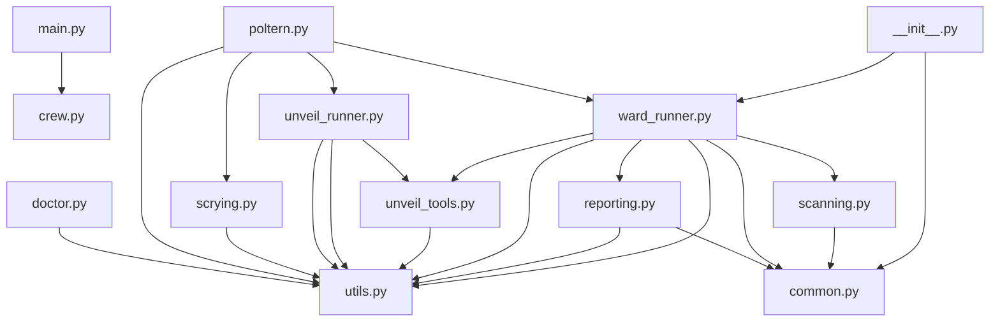

# Unveil: Codebase Map

_Root_: `Geist-Agent`  
_Files summarized_: **18**

## Overview

```markdown
# Unveil: Codebase Map Overview

## Entry Points & Main Flows
- **`geist_agent/src/geist_agent/__init__.py`**: Entrypoint for the Geist Agent module.
- **`geist_agent/src/geist_agent/main.py`**: Entry point for running, training, replaying, and testing the GeistAgent crew locally.

## Key Components & Collaboration
- **`geist_agent/src/geist_agent/crew.py`**: Defines and configures agents and tasks for the GeistAgent crew.
- **`geist_agent/src/geist_agent/unveil_runner.py`**: Generates structured summaries of files and provides a repository overview.
- **`geist_agent/src/geist_agent/scrying.py`**: Conducts research and generates reports.
- **`geist_agent/src/geist_agent/ward/reporting.py`**: Produces security reports based on detected vulnerabilities, secrets, and issues.

## Notable Patterns & Utility Functions
- **`geist_agent/src/geist_agent/unveil_tools.py`**: Contains utility functions for file walking, chunking, static import extraction, and dependency resolution.
- **`geist_agent/src/geist_agent/utils.py`**: Provides utilities for file system operations, report generation, and environment variable management.
- **`geist_agent/src/geist_agent/ward/scanning.py`**: Scans for dependency vulnerabilities using OSV APIs and local manifest files.
- **`geist_agent/src/geist_agent/tools/__init__.py`**: Offers utility functions for the Geist Agent application.

## Ward Module
- **`geist_agent/src/geist_agent/ward/common.py`**: Utility file with common definitions and helper functions.
- **`geist_agent/src/geist_agent/ward/runner.py`**: Executes security audits using various scanning methods, including OSV CLI/API, secret scanning, and LLM recommendations.

## Custom Tool
- **`geist_agent/src/geist_agent/tools/custom_tool.py`**: Defines a custom tool for agents to utilize, providing input schema and implementation.
```

## Components

### geist_agent

- `geist_agent/src/geist_agent/__init__.py`
- `geist_agent/src/geist_agent/crew.py`
- `geist_agent/src/geist_agent/doctor.py`
- `geist_agent/src/geist_agent/main.py`
- `geist_agent/src/geist_agent/poltern.py`
- `geist_agent/src/geist_agent/scrying.py`
- `geist_agent/src/geist_agent/tools/__init__.py`
- `geist_agent/src/geist_agent/tools/custom_tool.py`
- `geist_agent/src/geist_agent/unveil_agent.py`
- `geist_agent/src/geist_agent/unveil_runner.py`
- `geist_agent/src/geist_agent/unveil_tools.py`
- `geist_agent/src/geist_agent/utils.py`
- `geist_agent/src/geist_agent/ward/__init__.py`
- `geist_agent/src/geist_agent/ward/common.py`
- `geist_agent/src/geist_agent/ward/reporting.py`
- `geist_agent/src/geist_agent/ward/runner.py`
- `geist_agent/src/geist_agent/ward/scanning.py`
- `geist_agent/src/geist_agent/ward_runner.py`

## Dependency Graph



## Files

### `geist_agent/src/geist_agent/__init__.py`
**Role:** Entrypoint for the Geist Agent module
**API:** geist_agent
**Summary:**
- This file serves as the main entry point for initializing and managing the Geist Agent functionality.
- It likely contains a class or function named `geist_agent` which is responsible for setting up and running the agent.
- The module might import or reference other internal files/modules to configure settings, handle dependencies, and manage the lifecycle of the agent.
- External callers will typically use this file to start the Geist Agent in their application.

### `geist_agent/src/geist_agent/crew.py`
**Role:** Defines and configures agents and tasks for GeistAgent crew
**API:** GeistAgent, researcher, reporting_analyst, research_task, reporting_task, crew
**Summary:**
- This class defines and configures agents and tasks for a specific type of agent called 'GeistAgent'.
- It includes methods to create different types of agents (researcher, reporting analyst) and tasks (research task, reporting task).
- The crew method aggregates these agents and tasks into a working GeistAgent crew.
- Each method uses configuration details from provided YAML files for precise setup.
- Decorators @agent, @task, and @crew are used to define the roles of different components.

### `geist_agent/src/geist_agent/doctor.py`
**Role:** Health check and diagnostics for the Geist Agent application
**API:** run
**Summary:**
- The file contains functions to perform various health checks on the Geist Agent environment.
- It includes checks for package versions, environment variables, Ollama models, and write access to reports directories.
- Results are displayed using Rich library for console output and can be outputted as JSON if requested.
- Checks are grouped into a list of callable functions which are executed in sequence.
- The `run` function acts as the entry point for these checks and handles both text-based and JSON outputs.

### `geist_agent/src/geist_agent/main.py`
**Role:** Entry point for running, training, replaying, and testing the GeistAgent crew locally
**API:** run, train, replay, test
**Summary:**
- The file defines public functions for running, training, replaying, and testing the GeistAgent crew.
- It imports necessary modules from within the geist_agent package to initialize and interact with the crew.
- Public functions are designed to be called directly or via command-line arguments for local execution.
- Exception handling is included in each function to manage errors during execution.
- The file uses datetime module for generating current year as part of input parameters.

### `geist_agent/src/geist_agent/poltern.py`

### `geist_agent/src/geist_agent/scrying.py`
**Role:** Scrying agent for conducting research and generating reports
**API:** ScryingAgent, researcher, reporting_analyst, research_task, reporting_task, scrying
**Summary:**
- Defines a Scrying Agent class responsible for performing research and creating reports.
- Provides methods to create specific agents (researcher, reporting analyst) and tasks (research task, reporting task).
- Uses utility functions from `ReportUtils` and `PathUtils` for generating filenames and ensuring directories exist.
- Sets the topic for report generation through the `set_topic` method.
- Deploys a sequential process to execute agents and tasks.

### `geist_agent/src/geist_agent/tools/__init__.py`
**Role:** Provides utility functions for geist_agent
**API:** geist_agent.tools.config_loader, geist_agent.tools.data_processor, geist_agent.tools.error_handler
**Summary:**
- This module contains various utility functions that are used by the geist_agent. These include configuration loading, data processing, and error handling.
- The `config_loader` function is responsible for loading configuration settings from a specified file or environment variables.
- The `data_processor` class handles the transformation and manipulation of data before it's used in various parts of the agent.
- The `error_handler` provides mechanisms to handle errors gracefully, ensuring that any issues are logged appropriately without halting the agent's operation.

### `geist_agent/src/geist_agent/tools/custom_tool.py`
**Role:** Defines a custom tool for an agent to utilize, providing input schema and implementation.
**API:** MyCustomTool
**Summary:**
- This file defines a `MyCustomTool` class that extends the `BaseTool` provided by `crewai.tools`. The tool accepts an input argument and processes it.
- The tool's schema is defined using Pydantic's `BaseModel`, ensuring that inputs are validated against expected types and formats.
- It provides a `_run` method to process the input argument, although the actual implementation is not provided in this snippet.
- The class includes metadata such as name and description for documentation purposes.
- This tool can be integrated into an agent system where it may be used based on its name and description.

### `geist_agent/src/geist_agent/unveil_agent.py`
**Role:** Unveil crew configuration loader for specific tasks and agents
**API:** UnveilCrew.load_configurations, UnveilCrew.map_all_task_variables, UnveilCrew.file_analyst, UnveilCrew.linker, UnveilCrew.architect, UnveilCrew.scan_and_summarize, UnveilCrew.cross_link, UnveilCrew.repo_narrative_and_render, UnveilCrew.unveil
**Summary:**
- Loads configurations for specific unveil tasks and agents from YAML files, ignoring unrelated tasks.
- Excludes non-unveil_* entries in the configuration to focus on relevant components.
- Maps task variables without using CrewBase's default behavior, ensuring custom task handling.
- Defines and returns multiple agent instances configured with specific settings.
- Provides optional task methods for scanning, summarizing, cross-linking, and rendering repository narratives.

### `geist_agent/src/geist_agent/unveil_runner.py`
**Role:** Codebase analysis tool that generates structured summaries of files and provides a repository overview.
**API:** run_unveil
**Summary:**
- The file implements `run_unveil`, which is the primary function to initiate codebase analysis by generating detailed summaries for each file.
- It leverages Language Model Agents (file_analyst and architect) to extract meaningful information from files and compile a concise repository overview.
- This tool supports customizable configurations such as include/exclude patterns, file extensions, and verbosity levels.
- It processes files in chunks, ensuring efficient memory usage while analyzing large codebases.
- Dependency inference is performed based on static imports and file interactions to identify inter-file dependencies.

### `geist_agent/src/geist_agent/unveil_tools.py`
**Role:** File contains utility functions for file walking, chunking, static import extraction, and dependency resolution.
**API:** _format_api_list, _format_summary_list, chunk_file, static_imports, _resolve_token_to_file, infer_edges_and_externals
**Summary:**
- The file provides utility functions for handling files and directories, including chunking large files into smaller segments.
- It includes methods to extract static import statements from various file types like Python, JavaScript, C++, Java, etc.
- Contains a function to resolve tokens to corresponding file paths based on the context of the source file.
- Includes a function that infers dependencies and external links between files within a directory structure.

### `geist_agent/src/geist_agent/utils.py`
**Role:** Utility functions for file system operations, report generation, and environment variable management
**API:** ReportUtils.generate_filename, EnvUtils.load_env_for_tool, PathUtils.geist_app_root, PathUtils.ensure_reports_dir, SCAN_EXTS_FULL, SCAN_EXTS_FAST, SKIP_DIRS, walk_files, walk_files_compat
**Summary:**
- This file contains utility classes and functions for handling file system operations, report generation, and environment variable management.
- It provides methods to generate filenames, load environment variables in specific precedence, find Geist application root directory, ensure reports directories exist, and scan files based on extensions and paths.
- The `walk_files` function supports both full and fast scanning of files with customizable include/exclude criteria.
- The file also includes sets of common extensions (`SCAN_EXTS_FULL`, `SCAN_EXTS_FAST`) and directories to skip during scans (`SKIP_DIRS`).
- These utilities are designed for use in a Geist tooling ecosystem, ensuring consistent handling of environment variables, report generation, and file scanning.

### `geist_agent/src/geist_agent/ward/__init__.py`
**Role:** Initialization and main entry point for the ward module in Geist Agent
**API:** run_ward, main, Vuln, SecretHit, Issue
**Summary:**
- Imports and exposes core functionalities including running ward, handling vulnerabilities, secrets, and issues.
- Serves as a central hub for initializing the ward module within the Geist Agent system.
- Provides fundamental classes like Vuln, SecretHit, and Issue which are likely used throughout the agent's operations.
- Functions such as run_ward and main are public APIs that allow external modules to interact with the ward functionality directly.
- This file is crucial for setting up the environment in which vulnerability scanning and related tasks are performed.

### `geist_agent/src/geist_agent/ward/common.py`
**Role:** Utility file containing common definitions and helper functions for the geist_agent application
**API:** _log, _reset_scan_meta, Vuln, SecretHit, Issue, _sev_sort_key, _max_sev_from_list, _best_severity_from_osv_payload, _which, _run, _LLM_KEYS, _apply_prefixed_env
**Summary:**
- This file defines common utility functions and data classes used across the geist_agent application.
- It includes logging utilities, metadata scanning helpers, severity sorting functions, and environment variable management for LLM profiles.
- The file serves as a central repository for shared types and helper methods to facilitate consistent behavior and configuration handling within the project.
- It also contains functions for executing shell commands and determining paths of executable programs.

### `geist_agent/src/geist_agent/ward/reporting.py`
**Role:** Generate security reports based on vulnerabilities, secrets, and issues detected in software dependencies
**API:** _get_ward_advisor, _crewai_out_to_text, llm_recommendations_with, _extract_theme_counts, _build_vulnerability_summary_md, _sev_counts, _vuln_details_url, _format_scan_input, render_ward_markdown
**Summary:**
- - The file contains functions to generate security reports based on detected vulnerabilities, secrets, and issues in software dependencies.
- - It includes an LLM advisor for generating recommendations and metrics extraction functions.
- - Functions are used to format the input data and generate a markdown report with detailed information.
- - It handles different sources of input such as CLI or API queries.
- - The report generated includes summaries by severity, ecosystem, package, themes, and top vulnerabilities.

### `geist_agent/src/geist_agent/ward/runner.py`
**Role:** Executes a security audit using various scanning methods including OSV (Open Source Vulnerability) CLI/API, secret scanning, and LLM recommendations to generate reports.
**API:** run_ward(path, include, exclude, exts, max_files, verbose, use_osv, redact, preview, llm, write_json, force_api), main
**Summary:**
- The file defines the `run_ward` function which is responsible for executing a security audit on specified project paths.
- It supports various scanning methods including OSV CLI and API, secret scanning, and LLM recommendations to generate detailed reports.
- The function uses logging to track its progress and provide verbose output.
- The `main` function serves as the entry point of the script, allowing users to run the audit via command-line arguments.
- It integrates with other modules from `geist_agent` for file walking, vulnerability enrichment, secret scanning, and report generation.

### `geist_agent/src/geist_agent/ward/scanning.py`
**Role:** Scans for dependency vulnerabilities using OSV (Open Source Vulnerability) APIs and local manifest files.
**API:** _collect_manifests, _pep_dep_exact, _poetry_exact_version, _npm_semver_exact, _collect_pinned_deps_for_osv, _osv_scan, _osv_api_scan, _enrich_vulns_with_details
**Summary:**
- Collects and processes manifest files from various package managers to identify dependency versions.
- Performs OSV API scans for vulnerabilities based on collected dependencies.
- Supports both command-line and API fallback methods for vulnerability scanning.
- Enriches vulnerability details by fetching additional information if needed.
- Handles backoff and retry mechanisms to manage HTTP request failures.

### `geist_agent/src/geist_agent/ward_runner.py`

## External Dependencies (inferred)

- `typing` ×14
- `pathlib` ×11
- `__future__` ×9
- `os` ×9
- `crewai` ×6
- `collections` ×4
- `crewai.project` ×3
- `crewai.agents.agent_builder.base_agent` ×3
- `dataclasses` ×3
- `sys` ×3
- `datetime` ×3
- `contextlib` ×3
- `re` ×3
- `typer` ×2
- `yaml` ×2
- `json` ×2
- `time` ×2
- `argparse` ×2
- `tomllib` ×2
- `importlib.metadata` ×1
- `rich.console` ×1
- `rich.table` ×1
- `rich.panel` ×1
- `rich.text` ×1
- `rich.markdown` ×1
- `warnings` ×1
- `geist_agent.customCrew` ×1
- `geist_agent` ×1
- `dotenv` ×1
- `fnmatch` ×1
- `itertools` ×1
- `shutil` ×1
- `subprocess` ×1
- `urllib.request` ×1
- `urllib.error` ×1
- `crewai.tools` ×1
- `pydantic` ×1
