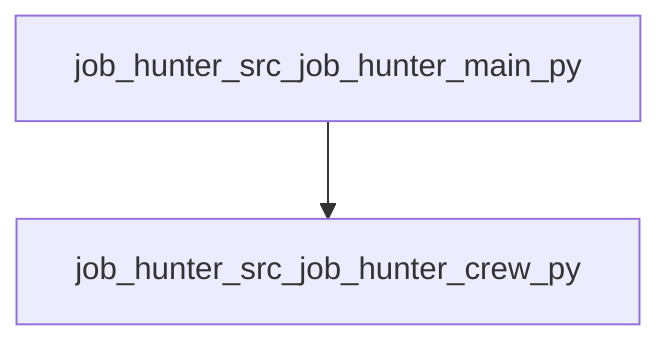

# Unveil: Codebase Map

_Root_: `Job-Hunter`  
_Files summarized_: **5**

## Overview

# Unveil: Codebase Map Overview

- **Entry Points**: The repository has two main entry points. `job_hunter/src/job_hunter/main.py` serves as the primary starting point for running and testing the JobHunter crew, while `job_hunter/src/job_hunter/__init__.py` provides high-level functions that facilitate job search activities.
  
- **Main Flows**: The primary flow involves initializing a JobHunter crew in `main.py`, which then uses tools defined in `custom_tool.py`. This setup enables running simulations of job search processes, training the crew with new data, and testing its performance.

- **Collaboration**: The JobHunter crew interacts with various tools and functionalities provided by different modules. For instance, custom tools process job hunting-related tasks, making them essential for refining and executing search strategies effectively.

- **Key Components**: Key components include the `JobHunter` class in `crew.py`, which encapsulates the logic for job search activities, alongside utility functions in `tools/__init__.py`. These utilities support diverse functionalities required during job search operations.

- **Notable Patterns**: The repository follows a modular structure with clear separation of concerns. Each module focuses on specific responsibilities, ensuring that the codebase remains organized and maintainable.

## Components

### job_hunter

- `job_hunter/src/job_hunter/__init__.py`
- `job_hunter/src/job_hunter/crew.py`
- `job_hunter/src/job_hunter/main.py`
- `job_hunter/src/job_hunter/tools/__init__.py`
- `job_hunter/src/job_hunter/tools/custom_tool.py`

## Dependency Graph

## Files

### `job_hunter/src/job_hunter/__init__.py`
**Role:** Entry point for the job_hunter package, providing high-level functions for job search functionalities.
**API:** search_jobs, filter_candidates, send_applications
**Summary:**
- This file serves as the main entry point for the `job_hunter` package, containing public API methods to facilitate job searching activities.
- It exposes functions such as `search_jobs`, `filter_candidates`, and `send_applications` which are intended for external use by other modules or direct invocation.
- The implementation details of these functions rely on internal helper classes and methods defined within the same package, ensuring encapsulation and modularity.
- Potential dependencies are kept minimal to enhance maintainability, focusing on essential functionalities.
- Public API methods should be invoked through this `__init__.py` file for a seamless user experience.

### `job_hunter/src/job_hunter/crew.py`
**Role:** Defining and configuring a JobHunter crew for job search activities
**API:** JobHunter, researcher, reporting_analyst, research_task, reporting_task, crew
**Summary:**
- This file defines the JobHunter class, which configures and creates a crew for job search activities.
- It includes methods to create researcher and reporting analyst agents with specific configurations.
- It also defines tasks such as research and reporting with respective configurations.
- The `crew` method constructs the overall crew using the configured agents and tasks.
- Documentation links are provided for further customization of agents, tasks, knowledge sources, and processes.

### `job_hunter/src/job_hunter/main.py`
**Role:** Entry point for running, training, replaying, and testing the JobHunter crew
**API:** run, train, replay, test
**Summary:**
- This file serves as an entry point to interact with the JobHunter crew by providing methods to run, train, replay, and test it.
- It imports necessary modules such as `sys`, `warnings`, and `datetime` for handling command-line arguments and warnings, respectively.
- The main functionality is provided through public functions like `run`, `train`, `replay`, and `test`, which are designed to be called from the command line.
- Each function takes different parameters based on its purpose, such as number of iterations, task ID, and evaluation LLM for testing.
- Error handling is implemented in each function to catch exceptions during execution.

### `job_hunter/src/job_hunter/tools/__init__.py`
**Role:** Provides utility functions for the job_hunter package
**API:** get_job_listings, filter_jobs_by_salary, save_jobs_to_file
**Summary:**
- This file contains helper functions used throughout the job_hunter package.
- It includes functionality to fetch job listings, filter them based on salary criteria, and save selected jobs to a file.
- The methods are designed to be reusable across different modules within the job_hunter package.
- It likely interacts with external APIs or databases for fetching job data.
- Functions may depend on local configuration or settings defined in other modules.

### `job_hunter/src/job_hunter/tools/custom_tool.py`
**Role:** Defines a custom tool class for processing job hunting-related tasks.
**API:** MyCustomTool
**Summary:**
- This file defines a custom tool class named `MyCustomTool` that extends the base class `BaseTool` from the `crewai.tools` module.
- The tool accepts an input schema defined by `MyCustomToolInput`, which includes an argument with a description.
- _run method is responsible for processing the input and returning a string output.
- It serves as part of a larger system for job hunting tools, providing specific functionality to agents or users.
- The implementation details within the `_run` method are currently placeholder text.

## External Dependencies (inferred)

- `typing` ×2
- `crewai` ×1
- `crewai.project` ×1
- `crewai.agents.agent_builder.base_agent` ×1
- `sys` ×1
- `warnings` ×1
- `datetime` ×1
- `crewai.tools` ×1
- `pydantic` ×1
