# Unveil: Codebase Map

_Root_: `Quail-Kingdom-Market`  
_Files summarized_: **34**

## Overview

# Unveil Codebase Map Overview

## Entry Points & Main Flows
- **src/main.js**: The primary entry point for the Vue.js application. It initializes the application and connects to other services.
- **src/router.js**: Configures routing within the app, handling transitions between different views and components.

## Collaboration of Parts
- `src/AppState.js` manages global state, influencing behavior across multiple components.
- `src/services/*`: These provide core functionalities such as account management (`src/services/AccountService.js`), authentication (`src/services/AuthService.js`), network requests via Axios (`src/services/AxiosService.js`), and more.

## Key Components
- **State Management**: Centralized in `src/AppState.js`, ensuring consistency across the application.
- **Environment Configuration**: Defined in `src/env.js` for different deployment environments.
- **Routing & Navigation**: Configured in `src/router.js`.

## Notable Patterns
- **Type Definitions**: Utilized via `@types/shims-vue.d.ts` to ensure type safety with Vue components.
- **Service Architecture**: A robust service layer (`src/services/*`) providing encapsulated, reusable functionality.

Edge count: 49, Component count: 5

## Components

### @types

- `@types/shims-vue.d.ts`

### eslint.config.js

- `eslint.config.js`

### index.html

- `index.html`

### src

- `src/AppState.js`
- `src/env.js`
- `src/handlers/RoomHandler.js`
- `src/main.js`
- `src/models/Account.js`
- `src/models/MagicItem.js`
- `src/router.js`
- `src/services/AccountService.js`
- `src/services/AuthService.js`
- `src/services/AxiosService.js`
- `src/services/MagicItemService.js`
- `src/services/PrintService.js`
- `src/services/SocketService.js`
- `src/tables/AllTableManager.js`
- `src/tables/BlackTableA.js`
- `src/tables/BlackTableB.js`
- `src/tables/BlackTableC.js`
- `src/tables/BlackTableD.js`
- `src/tables/BlackTableE.js`
- `src/tables/TableA.js`
- `src/tables/TableB.js`
- `src/tables/TableC.js`
- `src/tables/TableD.js`
- `src/tables/TableE.js`
- `src/utils/Logger.js`
- `src/utils/Pop.js`
- `src/utils/SocketHandler.js`
- `src/utils/Store.js`
- `src/utils/registerGlobalComponents.js`
- `src/utils/registerGlobalSocketHandlers.js`

### vite.config.js

- `vite.config.js`

## Dependency Graph

```mermaid
graph TD
  index_html["index.html"]
  src_App_vue["App.vue"]
  src_AppState_js["AppState.js"]
  src_env_js["env.js"]
  src_handlers_RoomHandler_js["RoomHandler.js"]
  src_main_js["main.js"]
  src_models_Account_js["Account.js"]
  src_models_MagicItem_js["MagicItem.js"]
  src_router_js["router.js"]
  src_services_AccountService_js["AccountService.js"]
  src_services_AuthService_js["AuthService.js"]
  src_services_AxiosService_js["AxiosService.js"]
  src_services_MagicItemService_js["MagicItemService.js"]
  src_services_SocketService_js["SocketService.js"]
  src_tables_AllTableManager_js["AllTableManager.js"]
  src_tables_BlackTableA_js["BlackTableA.js"]
  src_tables_BlackTableB_js["BlackTableB.js"]
  src_tables_BlackTableC_js["BlackTableC.js"]
  src_tables_BlackTableD_js["BlackTableD.js"]
  src_tables_BlackTableE_js["BlackTableE.js"]
  src_tables_TableA_js["TableA.js"]
  src_tables_TableB_js["TableB.js"]
  src_tables_TableC_js["TableC.js"]
  src_tables_TableD_js["TableD.js"]
  src_tables_TableE_js["TableE.js"]
  src_utils_Logger_js["Logger.js"]
  src_utils_Pop_js["Pop.js"]
  src_utils_SocketHandler_js["SocketHandler.js"]
  src_utils_Store_js["Store.js"]
  src_utils_registerGlobalComponents_js["registerGlobalComponents.js"]
  src_utils_registerGlobalSocketHandlers_js["registerGlobalSocketHandlers.js"]
  index_html --> src_main_js
  src_AppState_js --> src_models_MagicItem_js
  src_AppState_js --> src_tables_AllTableManager_js
  src_main_js --> src_App_vue
  src_main_js --> src_utils_registerGlobalComponents_js
  src_main_js --> src_utils_registerGlobalSocketHandlers_js
  src_main_js --> src_router_js
  src_handlers_RoomHandler_js --> src_utils_Logger_js
  src_handlers_RoomHandler_js --> src_utils_SocketHandler_js
  src_services_AccountService_js --> src_AppState_js
  src_services_AccountService_js --> src_models_Account_js
  src_services_AccountService_js --> src_utils_Logger_js
  src_services_AccountService_js --> src_services_AxiosService_js
  src_services_AuthService_js --> src_AppState_js
  src_services_AuthService_js --> src_env_js
  src_services_AuthService_js --> src_services_AccountService_js
  src_services_AuthService_js --> src_services_AxiosService_js
  src_services_AuthService_js --> src_services_SocketService_js
  src_services_AxiosService_js --> src_env_js
  src_services_AxiosService_js --> src_utils_Logger_js
  src_services_MagicItemService_js --> src_AppState_js
  src_services_SocketService_js --> src_utils_Pop_js
  src_services_SocketService_js --> src_utils_SocketHandler_js
  src_tables_AllTableManager_js --> src_tables_TableA_js
  src_tables_AllTableManager_js --> src_tables_TableB_js
  src_tables_AllTableManager_js --> src_tables_TableC_js
  src_tables_AllTableManager_js --> src_tables_TableD_js
  src_tables_AllTableManager_js --> src_tables_TableE_js
  src_tables_AllTableManager_js --> src_tables_BlackTableA_js
  src_tables_AllTableManager_js --> src_tables_BlackTableB_js
  src_tables_AllTableManager_js --> src_tables_BlackTableC_js
  src_tables_AllTableManager_js --> src_tables_BlackTableD_js
  src_tables_AllTableManager_js --> src_tables_BlackTableE_js
  src_tables_BlackTableA_js --> src_models_MagicItem_js
  src_tables_BlackTableB_js --> src_models_MagicItem_js
  src_tables_BlackTableC_js --> src_models_MagicItem_js
  src_tables_BlackTableD_js --> src_models_MagicItem_js
  src_tables_BlackTableE_js --> src_models_MagicItem_js
  src_tables_TableA_js --> src_models_MagicItem_js
  src_tables_TableB_js --> src_models_MagicItem_js
  src_tables_TableC_js --> src_models_MagicItem_js
  src_tables_TableD_js --> src_models_MagicItem_js
  src_tables_TableE_js --> src_models_MagicItem_js
  src_utils_Logger_js --> src_env_js
  src_utils_registerGlobalSocketHandlers_js --> src_utils_Logger_js
  src_utils_SocketHandler_js --> src_env_js
  src_utils_SocketHandler_js --> src_utils_Logger_js
  src_utils_Store_js --> src_utils_Logger_js
  src_utils_Store_js --> src_utils_Pop_js
```

## Files

### `@types/shims-vue.d.ts`
**Role:** Type definition shimming for Vue components
**API:** default
**Summary:**
- This file provides type definitions for dynamically imported .vue files, treating them as Vue component instances.
- It allows TypeScript to understand the structure of Vue components when they are lazily loaded or imported using a glob pattern.
- The `default` export is used to represent a Vue component instance within typescript code.
- This file ensures type safety for developers working with Vue components in a TypeScript environment without requiring full module imports.
- It leverages the global `Vue` object and `defineComponent` method from Vue to infer component definitions.

### `eslint.config.js`
**Role:** Configures ESLint rules for JavaScript and Vue.js files
**API:** default
**Summary:**
- Exports a default configuration object for ESLint.
- Includes both global and plugin configurations.
- Applies recommended settings from the @eslint/js plugin.
- Customizes Vue.js specific rules via the eslint-plugin-vue plugin.
- Overrides some default rules to adjust strictness or disable/enable specific warnings.

### `index.html`
**Role:** HTML file for defining the structure and metadata of a web page
**Summary:**
- Defines the basic HTML structure for a webpage titled 'Quail-Kingdom-Market'
- Includes necessary meta tags for character set, viewport, and theme support
- Provides an icon link for the favicon
- Displays a noscript message informing users about JavaScript dependency
- Contains a div with id 'app' where the React application will be rendered
- References a script tag to load the main JavaScript file for the application

### `src/AppState.js`
**Role:** Holds application state for the main application
**API:** AppState
**Summary:**
- AppState is a reactive object holding various pieces of information needed by the application, such as user identity and account data.
- It also contains dynamic tables for managing magic items and homebrew items.
- The AppState object is used to store rolling results which are likely related to dice rolls or item selection processes in the game.
- MagicItem model is imported from './models/MagicItem.js' for handling the management of magical items.

### `src/env.js`
**Role:** Environment configuration file
**API:** dev, baseURL, useSockets, domain, clientId, audience
**Summary:**
- Exports environment-specific variables like base URL and development status.
- Configures whether the application runs in a development environment ('localhost' check).
- Sets the base URL based on the development flag.
- Indicates if sockets should be used (false in this case).
- Exposes empty strings for domain, client ID, and audience, suggesting they are not utilized.

### `src/handlers/RoomHandler.js`
**Role:** Handles room-related socket events for a chat application
**API:** RoomHandler
**Summary:**
- The RoomHandler class is responsible for managing room-related socket events such as joining, leaving, user joining, and user leaving.
- It extends the SocketHandler class to inherit common functionality and focuses on logging related actions using a logger instance.
- Public methods are defined to handle specific event types: 'JOINED_ROOM', 'LEFT_ROOM', 'USER_JOINED', and 'USER_LEFT'.
- Each method logs relevant information about the event, including room names or user details.
- The RoomHandler is instantiated as `roomHandler` and made publicly available for use.

### `src/main.js`
**Role:** Entry point for a Vue.js application
**API:** init
**Summary:**
- Serves as the entry point for a Vue.js application by initializing the app and mounting it to the DOM.
- Imports necessary CSS files, global components, router configuration, and socket handlers.
- Registers global components and sets up socket event handlers globally.
- Configures the root Vue instance with routes and mounts it to the '#app' element in the DOM.
- Utilizes internal utilities for global component registration and socket handler setup.

### `src/models/Account.js`
**Role:** Defines and manages account data objects
**API:** Account
**Summary:**
- The file exports a class named Account that represents an account object with properties like id, email, name, and picture.
- It uses a typedef to define the structure of AccountData which includes id, email, name, and picture as its properties.
- The constructor initializes the account object based on provided data.
- There is TODO comment suggesting potential future extensions by adding more properties.
- This class might be used in parts of the application where user accounts need to be represented.

### `src/models/MagicItem.js`
**Role:** Class definition for MagicItem model
**API:** MagicItem
**Summary:**
- Defines a class for representing magic items in the game.
- Initializes an instance with data provided by the game's data source.
- Includes properties such as name, rarity, type, weight, attunement, description, price, isConsumable, range, and blackMarket availability.
- Sets default values for missing data to avoid errors during initialization.

### `src/router.js`
**Role:** Configures and exports the Vue Router instance for an application.
**API:** router
**Summary:**
- Imports necessary modules from 'vue-router' and '@bcwdev/auth0provider-client'.
- Defines routes with paths, names, components, and an authentication guard.
- Configures the router's history mode using web hash.
- Exposes a single public router instance for use in the application.
- Ensures that certain pages are protected by an authGuard before entering.

### `src/services/AccountService.js`
**Role:** Manages account-related operations for the application.
**API:** getAccount
**Summary:**
- The AccountService class is responsible for handling account-related API calls and managing the application state.
- It exposes a public method `getAccount` which retrieves the current user's account details.
- The service interacts with an external API endpoint '/account' to fetch data.
- It updates the `AppState.account` object with the retrieved account information.
- Error handling is implemented to log any issues that occur during the API call.

### `src/services/AuthService.js`

### `src/services/AxiosService.js`
**Role:** Axios Service Configuration and Error Handling
**API:** api
**Summary:**
- Configures Axios instance for API requests with a base URL and timeout.
- Implements request and response interceptors to handle Axios errors.
- Logs detailed error messages using the Logger utility.
- Provides a reusable Axios service for consistent API interactions.

### `src/services/MagicItemService.js`
**Role:** Service for handling magic item calculations and dynamic UI elements
**API:** rollDie, calculateTotalRoll, initializePercentileRolls, findMagicItems, getPriceFormula, getDieForRarity, calculatePriceFromRoll, getTextSize, getHeaderSize, getSubTextSize, addRandomQuails, repositionQuails
**Summary:**
- Provides methods for rolling dice and calculating the total roll value for magic items.
- Includes functionality to initialize percentile rolls, find matching magic items based on a roll, and calculate prices based on rarity.
- Manages dynamic UI elements like quail silhouettes which reposition themselves randomly across the screen.
- Depends on AppState for state management, including magic items and their ranges.
- Repositions and animates quails in response to window size changes.

### `src/services/PrintService.js`
**Role:** Provides functionality for printing magic items in a formatted HTML page
**API:** printPage(items: Array of objects, blackMarketMode: Boolean, logoUrl: String, sealUrl: String), getHeaderStyle(item: Object), getSubTextStyle(item: Object), getTextStyle(description: String)
**Summary:**
- The PrintService class is responsible for generating a formatted HTML page to print magic items.
- It includes methods to dynamically generate the content, apply appropriate styles, and manage print window operations.
- The service can handle black market mode, conditional labels, and different text sizes based on item descriptions.
- Printed pages are styled with specific margins, fonts, and layout for a consistent look.
- The HTML generated includes a header section with the logo and footer signature.

### `src/services/SocketService.js`
**Role:** Provides socket handling functionality with error reporting
**API:** SocketService
**Summary:**
- The file defines a `SocketService` class that extends `SocketHandler` and handles socket errors by showing them as toast notifications.
- Upon initialization, it sets up an event listener for the 'error' event from the socket.
- It uses Pop.toast to display error messages received through the socket connection.

### `src/tables/AllTableManager.js`
**Role:** Central management and provision of various table implementations
**API:** AllTables
**Summary:**
- Serves as a central manager for different types of tables including both standard and black market versions.
- Exports an object `AllTables` containing references to multiple table implementations (A, B, C, D, E) and their respective black market counterparts.
- Facilitates easy access and switching between standard and black market table implementations through a single export point.
- Uses local imports from other table management files for implementation details.
- Likely called by higher-level managers or modules that need to utilize various types of tables in the application.

### `src/tables/BlackTableA.js`
**Role:** Defines black-market magic items for a game or simulation
**API:** blackMarketTableA
**Summary:**
- This file exports a table of common black-market magic items with their properties and descriptions.
- The items are defined as instances of the MagicItem class from '../models/MagicItem.js'.
- Each item has attributes like name, rarity, type, blackMarket status, weight, attunement requirement, range, and description.
- The table includes a range key to define which entries should be considered for selection or display.
- It likely serves as a data source for populating black-market inventories in a game or simulation.

### `src/tables/BlackTableB.js`
**Role:** Defines a black market item table for a range of 1010-1018 with detailed descriptions and properties of each item.
**API:** blackMarketTableB
**Summary:**
- This file exports an object `blackMarketTableB` containing details about various uncommon magic items suitable for black market use.
- Each item has attributes such as name, rarity, type, attunement, weight, and a detailed description of its properties and effects.
- The table likely serves as a reference or data source for generating content related to black market operations in a game or simulation.
- Items are categorized by their usefulness in stealth, deception, combat, and general criminal activities.

### `src/tables/BlackTableC.js`
**Role:** Defines a range and items for the BlackMarketTableC
**API:** blackMarketTableC
**Summary:**
- This file exports a constant `blackMarketTableC` which defines a range and an array of MagicItem objects.
- The `blackMarketTableC` object contains a range defined by `[1019, 1027]` and an array of MagicItems with detailed descriptions including their rarity, type, attunement requirement, weight, and special abilities or properties.
- It serves as part of the in-game item database for managing rare and unique magical items available through a black market in a fantasy setting.
- The file is designed to be used by other parts of the application that require details about these specific magic items.

### `src/tables/BlackTableD.js`
**Role:** Contains a black market table for Very Rare Magic Items with specific properties and descriptions
**API:** blackMarketTableD
**Summary:**
- The file defines an object `blackMarketTableD` containing an array of Very Rare Magic Item entries, each with detailed attributes like name, type, rarity, and effects.
- Each item in the table has properties such as weight, attunement status, range, and a description detailing its abilities and benefits.
- The items are categorized by their type (e.g., weapon, wondrous item) and include unique magical effects relevant to various character roles in a fantasy setting.
- This table is likely used for generating content or displaying information about black market items in a game or application.
- The data structure allows for easy expansion by adding more entries if needed.

### `src/tables/BlackTableE.js`
**Role:** Contains a table of Legendary magic items for a Black Market in a fantasy game
**API:** blackMarketTableE
**Summary:**
- The file defines a table containing multiple legendary magic items with their descriptions, types, rarities, and other properties.
- Each item has attributes such as name, rarity, type, attunement requirements, weight, range, and detailed description.
- This table is likely used to generate or display these items in the game's Black Market.
- The data structure allows for easy expansion or modification of items by adding or altering entries within the array.

### `src/tables/TableA.js`
**Role:** Contains an array of common MagicItems for a tabletop game
**API:** tableA
**Summary:**
- Holds a list of common MagicItems with their details including name, rarity, type, weight, attunement requirement, and description.
- The `tableA` object contains an array of objects representing these items.
- Each item in the array is instantiated from the `MagicItem` class or similar constructor function.
- The data structure likely serves as a reference or configuration for the game's inventory system.
- It may be used to populate player characters' inventories with common magical items.

### `src/tables/TableB.js`
**Role:** Table for generating random Magic Items in a game
**API:** tableB
**Summary:**
- This file defines a table `tableB` containing ranges and a list of magic items with their details.
- The function `tableB` is exported, allowing it to be used elsewhere to generate random Magic Items based on predefined criteria.
- It imports `MagicItem` from the `models/MagicItem.js` module for creating the instances of these items.
- The table includes a wide variety of magic items with different properties like rarity, type, attunement, and special abilities.
- Based on the imported `MagicItem`, it suggests that this file is part of a larger system dealing with game item management.

### `src/tables/TableC.js`
**Role:** Contains a table of magic items with their attributes and descriptions for a game or simulation
**API:** tableC
**Summary:**
- This file defines an object `tableC` that contains arrays of magic item objects, each with specific properties like name, rarity, type, weight, attunement requirement, range, and description.
- The items are categorized by their magical abilities, such as increasing AC, providing bonus to skill checks, or casting spells.
- It likely interacts with other modules that might use this table for displaying or managing magic items in a game.
- The file imports `MagicItem` from another module, indicating it relies on a predefined class for item creation.

### `src/tables/TableD.js`
**Role:** Contains an array of magic items with detailed properties for a game
**API:** tableD
**Summary:**
- This file defines a constant `tableD` containing an array of MagicItems, each with attributes like name, rarity, type, weight, attunement status, range, and description.
- The data is organized into items that are categorized based on their type (Wondrous Item, Armor, Weapon) and rarity (Very Rare, Legendary, etc.).
- Each item has unique properties such as resistance to certain damage types, temporary hit points, or specific magical effects like casting spells or altering attributes.
- The `tableD` constant is exported for use in other parts of the application, likely for generating content or data-driven gameplay elements.
- The file imports `MagicItem` from a different module, indicating it relies on predefined item structures.

### `src/tables/TableE.js`
**Role:** Contains an array of magic items with detailed descriptions for a Dungeons & Dragons campaign
**API:** tableE
**Summary:**
- The file exports a single constant `tableE` which is an object containing arrays of MagicItem instances.
- Each item in the `items` array has properties like name, rarity, type, weight, attunement, and description.
- The `range` property defines a range for filtering or categorizing items.
- This file likely serves as a data source for generating magic items within a D&D campaign.
- Items are categorized by their rarity and magical abilities.

### `src/utils/Logger.js`
**Role:** Provides logging utilities for different log levels
**API:** logger.log, logger.error, logger.warn, logger.assert, logger.trace, logger.groupCollapsed, logger.groupEnd
**Summary:**
- The file defines a logger object with various methods for logging messages of different types (log, error, warn, assert, trace).
- Logging is only performed in development mode; in production, logs are currently not sent to an external service but are still logged locally.
- The logger uses the console API for local logging and includes functionality for grouping log entries.
- The file imports configuration settings from '../env.js' to determine whether it should execute in dev or prod mode.
- It is designed to be imported by other modules that require logging capabilities.

### `src/utils/Pop.js`
**Role:** Provides utility functions for creating custom dialogs and toast notifications
**API:** Pop.createDialog, Pop.success, Pop.error, Pop.toast, Pop.confirm, Pop.prompt, Pop.createToastContainer
**Summary:**
- The file exports utility functions to create custom dialogs and toast notifications, providing customizable options such as colors, icons, and input types.
- It uses predefined color configurations stored in `colorConfig` object.
- Dialogs and toasts are created using the DOM API by manipulating HTML elements.
- It includes a helper function `_tryParseInput` for parsing user inputs based on their type.

### `src/utils/SocketHandler.js`
**Role:** Handles socket communication for the application
**API:** getSocketConnection(url), registerGlobalSocketMessages(socket), runPlayback, on(event, fn), authenticate(bearerToken), enqueue(action, payload), emit(action, payload)
**Summary:**
- Manages socket connections and handles various events such as connection, authentication, and playback.
- Uses a global `socket` instance to manage communication with the server.
- Enqueues actions for later execution if authentication is required before sending them over the socket.
- Provides methods to register event listeners, authenticate users, enqueue actions, and emit messages.
- Depends on a logger for logging purposes and uses an `io` client from 'socket.io-client' for communication.

### `src/utils/Store.js`
**Role:** State management utility functions for local storage
**API:** saveState(key, value), loadState(key, instanceType)
**Summary:**
- Provides methods to save and load state data using localStorage.
- The `saveState` function stores or removes a key-value pair in localStorage with an optional app-specific prefix.
- The `loadState` function retrieves stored state data based on the provided key, optionally instantiating it as specified by instanceType.
- Error handling is implemented through logging and error popups.
- Uses other utility files like Logger.js and Pop.js for logging and error messaging.

### `src/utils/registerGlobalComponents.js`
**Role:** Registers global Vue components in the root instance
**API:** registerGlobalComponents
**Summary:**
- The file exports an asynchronous function to register globally available Vue components.
- It uses import.meta.glob to dynamically import all `.vue` files from a specified directory.
- Each imported component is registered in the provided root instance using its name as the key.
- The function iterates over each file, extracts the component name, and imports the actual component module.
- Finally, it registers the component with the root instance under the extracted name.

### `src/utils/registerGlobalSocketHandlers.js`
**Role:** Registers global socket handlers for a web application
**API:** registerSocketHandlers, SocketProviderPlugin
**Summary:**
- The file defines a `SocketProviderPlugin` class that initializes and registers global socket handlers.
- It imports a logger from `./Logger.js` for logging purposes.
- It uses dynamic import to load handler files from the `../handlers` directory based on file names.
- Handlers are stored in memory under the `SocketProviderPlugin` instance.
- Initialization of `SocketProviderPlugin` is handled automatically by creating an instance at the end of the file.

### `vite.config.js`
**Role:** Vite configuration file for building Vue.js applications
**Summary:**
- Defines Vite plugins for integrating Vue.js and ESLint into the project.
- Configures URL resolution to use Node.js's URL module for paths starting with '@'.
- Sets server port to 8080 for development purposes.
- Disables sourcemap generation during production build.
- Provides a commented-out base path for deploying to GitHub Pages.

## External Dependencies (inferred)

- `vue` ×3
- `@bcwdev/auth0provider-client` ×2
- `globals` ×1
- `@eslint/js` ×1
- `eslint-plugin-vue` ×1
- `/img/Quail-Favicon.png` ×1
- `node:url` ×1
- `vite` ×1
- `@vitejs/plugin-vue` ×1
- `vite-plugin-vue-devtools` ×1
- `vite-plugin-eslint` ×1
- `@mdi/font/css/materialdesignicons.css` ×1
- `@/assets/scss/style.scss` ×1
- `bootstrap/dist/js/bootstrap.bundle.js` ×1
- `vue-router` ×1
- `axios` ×1
- `@/assets/img/Quail-Silhouette-20opacity.png` ×1
- `socket.io-client` ×1
