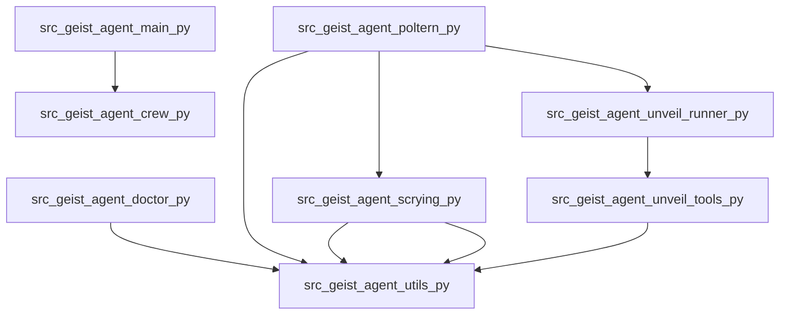

# Unveil: Codebase Map

_Root_: `geist_agent`  
_Files summarized_: **13**

## Overview

# Unveil: Codebase Map

- **Entry Points**:
  - `src/geist_agent/__init__.py`: Initializes the package.
  - `src/geist_agent/main.py`: Entry point for local GeistAgent operations.

- **Main Flows**:
  - The application starts by configuring a crew using `crew.py` and defining tools in `tools/__init__.py`.
  - Environment checks are performed with `doctor.py`, ensuring the system is ready.
  - Code analysis and reporting tasks run via `unveil_runner.py`.

- **Collaboration of Parts**:
  - `parse.py` and `poltern.py` handle command-line arguments, providing a CLI interface.
  - `unveil_agent.py` manages specific task configurations, while `scrying.py` handles research operations.

- **Key Components**:
  - `utils.py`: Utility functions for report generation and environment management.
  - `unveil_runner.py` and `unveil_tools.py`: Core components that process code files, generate dependency graphs, and produce summaries.

- **Notable Patterns**:
  - Utilizes the CrewAI framework for agent configuration in `crew.py`.
  - Employs a CLI-driven approach with tools defined via `tools/__init__.py` and individual tool implementations.

## Components

### src

- `src/geist_agent/__init__.py`
- `src/geist_agent/crew.py`
- `src/geist_agent/doctor.py`
- `src/geist_agent/main.py`
- `src/geist_agent/parse.py`
- `src/geist_agent/poltern.py`
- `src/geist_agent/scrying.py`
- `src/geist_agent/tools/__init__.py`
- `src/geist_agent/tools/custom_tool.py`
- `src/geist_agent/unveil_agent.py`
- `src/geist_agent/unveil_runner.py`
- `src/geist_agent/unveil_tools.py`
- `src/geist_agent/utils.py`

## Dependency Graph

## Files

### `src/geist_agent/__init__.py`
**Role:** Entry point for the geist_agent package
**API:** geist_agent
**Summary:**
- Serves as an initialization file for importing and exporting functionality from the geist_agent package.
- Exports the main `geist_agent` class which is likely used to instantiate the agent logic.
- Contains imports for submodules or components that are necessary for the proper functioning of the agent.
- Facilitates easy access to the core functionalities by exposing them at the top-level of the package.
- Ensures that all required dependencies are loaded and available when the package is imported.

### `src/geist_agent/crew.py`
**Role:** Defining and configuring a GeistAgent crew using CrewAI framework
**API:** GeistAgent(CrewBase), researcher(Agent), reporting_analyst(Agent), research_task(Task), reporting_task(Task), crew(Crew)
**Summary:**
- This file defines a GeistAgent class that configures and manages researchers, reporting analysts, tasks, and the overall crew using CrewAI framework.
- It includes methods to create specific agents (researcher and reporting_analyst) with configurable parameters.
- The research_task and reporting_task methods configure structured tasks for the crew.
- The crew method initializes the GeistAgent crew by combining configured agents and tasks, specifying a sequential process.
- Decorators like @agent, @task, and @crew are used to define different components of the crew.

### `src/geist_agent/doctor.py`
**Role:** A diagnostic tool for Geist Agent environment checks
**API:** run
**Summary:**
- The file contains utility functions to check various aspects of the Geist Agent environment such as package versions, environment variables, Ollama models availability, and reports directory write permissions.
- It exposes a command-line entry point `run` which can be used to perform diagnostics and output results in JSON or rendered format.
- The tool also provides utility methods for checking specific aspects like Python version, environment settings, Ollama model presence, and local file system write permissions.
- Diagnostic results are displayed using Rich library for styled text and table rendering.

### `src/geist_agent/main.py`
**Role:** Entry point for running GeistAgent operations locally
**API:** run, train, replay, test
**Summary:**
- This file serves as the main entry point for local execution of GeistAgent operations.
- It provides functions to run, train, replay, and test the crew defined in `GeistAgent`.
- The configuration for these operations is provided via command-line arguments.
- Each function handles the execution flow by invoking methods from the `GeistAgent` class.
- Error handling is included to catch and report issues during operation.

### `src/geist_agent/parse.py`
**Role:** Command-line argument parser for Geist agent
**API:** parse_args
**Summary:**
- The file defines a command-line argument parser that supports subcommands.
- It primarily handles the 'scry' command, allowing users to specify research topics.
- The function `parse_args` returns parsed arguments which can be used by other parts of the application.
- Help messages and examples are provided for both general help and specific subcommand help.

### `src/geist_agent/poltern.py`
**Role:** CLI for Geist Agent Tools
**API:** scry(topic), doctor(as_json), unveil_cmd(path, include, exclude, ext, max_files)
**Summary:**
- The file defines a CLI application for the Geist Agent tools, providing commands for scrying, doctor diagnostics, and unveiling codebases.
- It uses Typer to define command-line interfaces for each of these operations.
- The `scry` function allows users to research topics by setting a topic parameter and performing a scrying action.
- The `doctor` function provides diagnostic information about the current environment, including version numbers, environment variables, and other details.
- The `unveil_cmd` function scans codebases for summaries, components, and dependency graphs, outputting these in Markdown format.

### `src/geist_agent/scrying.py`
**Role:** ScryingAgent for research and reporting operations
**API:** ScryingAgent, researcher(), reporting_analyst(), research_task(), reporting_task(), scrying()
**Summary:**
- This file defines the ScryingAgent class for conducting research and generating reports.
- It includes methods to create specific agents (researcher, reporting analyst) and tasks (research task, reporting task).
- The `scrying` method constructs a Crew with these components.
- Reports are generated based on the provided topic and saved in a dedicated directory.
- Uses utility functions from geist_agent.utils for filename generation and ensuring directories exist.

### `src/geist_agent/tools/__init__.py`
**Role:** Provides initialization and configuration for geist_agent tools
**Summary:**
- Initializes various tools used by the geist_agent.
- Configures settings and dependencies required for the agent's operation.
- Imports submodules to provide access to different functionalities within the tools directory.
- Serves as a central point of entry for managing geist_agent’s tooling configuration.
- Ensures that all necessary components are set up before the agent starts.

### `src/geist_agent/tools/custom_tool.py`
**Role:** Defines a custom tool for an agent using the BaseTool framework from crewai.tools
**API:** MyCustomToolInput, MyCustomTool
**Summary:**
- The file defines a custom tool input schema and implementation using the BaseTool framework.
- It includes an input model class `MyCustomToolInput` for defining arguments expected by the tool.
- A custom tool class `MyCustomTool` is implemented with a specific name, description, and input schema.
- _run method is defined to handle the execution logic of the tool based on provided arguments.
- No external dependencies are explicitly imported or used within the file.

### `src/geist_agent/unveil_agent.py`
**Role:** Unveil crew configuration and management for specific tasks
**API:** UnveilCrew
**Summary:**
- The file defines the UnveilCrew class which loads specific configurations for agents and tasks, ignoring unrelated ones.
- It exposes methods to create and configure agents (file_analyst, linker, architect) and optional tasks (scan_and_summarize, cross_link, repo_narrative_and_render).
- The unveil method combines the configured agents and tasks into a Crew entity with sequential processing.
- The class avoids loading all fallback configurations by overriding some methods from CrewBase.
- It uses YAML files to load agent and task configurations.

### `src/geist_agent/unveil_runner.py`
**Role:** Runs an analysis on code files in a directory, generating summaries and a repository overview.
**API:** run_unveil
**Summary:**
- The function `run_unveil` processes a specified directory to analyze its code files.
- It uses the `file_analyst` agent for file-level summaries and the `architect` agent for generating a repository overview.
- Summary data is collected from each file, including role, API, summary points, dependencies, and callers.
- The function also handles file chunking, static imports, and external references to generate comprehensive reports.
- Finally, it compiles all the information into a report that includes edge inferences and components.

### `src/geist_agent/unveil_tools.py`
**Role:** Generates code dependency graphs and reports
**API:** _format_api_list, _format_summary_list, walk_files, chunk_file, static_imports, _resolve_token_to_file, infer_edges_and_externals, components_from_paths, _mermaid, render_report
**Summary:**
- The file contains functions for generating code dependency graphs and reports.
- It includes utilities for formatting API and summary lists, walking files, chunking files, resolving tokens to files, inferring edges and externals, identifying components, creating Mermaid diagrams, and rendering reports.
- Functions operate on various file types including Python (.py), JavaScript/TypeScript (.js, .mjs, .cjs, .ts, .tsx, .jsx), C/C++ (.c, .h, .hpp, .hh, .cc, .cpp) and others like CSS, HTML, SQL.
- It exports functions that can be used to analyze codebase dependencies and generate visual representations of these dependencies.

### `src/geist_agent/utils.py`
**Role:** Utility functions for generating reports and managing environment variables
**API:** ReportUtils.generate_filename(topic, max_topic_length), EnvUtils.load_env_for_tool, PathUtils._find_repo_root_from_cwd, PathUtils.ensure_reports_dir(subfolder)
**Summary:**
- This file contains utility functions for generating filenames, loading environment variables, finding the repository root, and ensuring the existence of reports directories.
- The `ReportUtils.generate_filename` function creates filenames based on topics and timestamps, handling invalid or missing input gracefully.
- The `EnvUtils.load_env_for_tool` method prioritizes loading environment variables from different locations such as an explicit .env file path, current directory, user configuration files, and repository root.
- The `_find_repo_root_from_cwd` method finds the repository root by checking for specific markers in parent directories of the current working directory.
- The `ensure_reports_dir` function ensures that a reports directory exists within the repository or at the current working directory, with an optional subfolder name.

## External Dependencies (inferred)

- `typing` ×10
- `pathlib` ×7
- `crewai` ×5
- `os` ×5
- `__future__` ×4
- `crewai.project` ×3
- `crewai.agents.agent_builder.base_agent` ×3
- `datetime` ×3
- `typer` ×2
- `sys` ×2
- `yaml` ×2
- `dataclasses` ×1
- `importlib.metadata` ×1
- `rich.console` ×1
- `rich.table` ×1
- `rich.panel` ×1
- `rich.text` ×1
- `rich.markdown` ×1
- `warnings` ×1
- `geist_agent.customCrew` ×1
- `argparse` ×1
- `geist_agent` ×1
- `json` ×1
- `time` ×1
- `collections` ×1
- `re` ×1
- `dotenv` ×1
- `crewai.tools` ×1
- `pydantic` ×1
